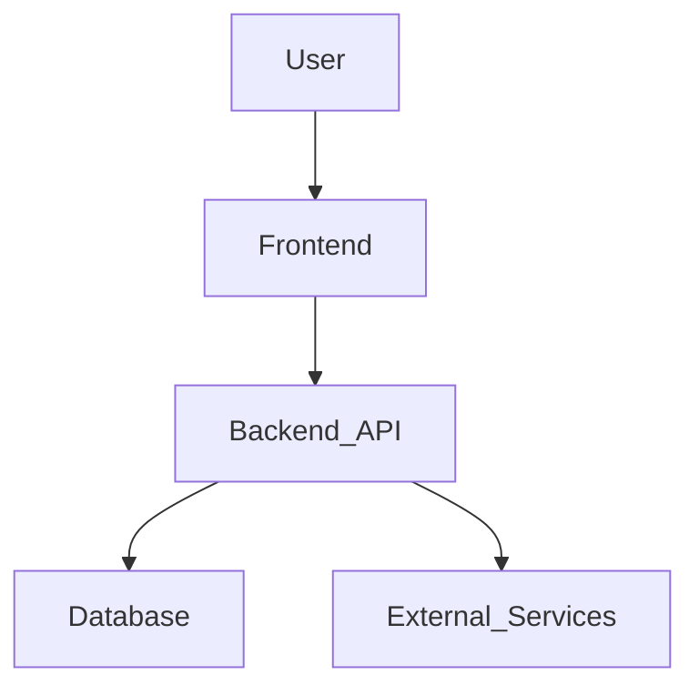

# Project Architecture

**Instructions for End-User:** This document is the single source of truth for the project's technical architecture. Populate it with diagrams, data flow descriptions, and technology stack details to ensure the Cascade AI understands how your system is built.

## High-Level Overview

*(Describe the overall architecture here. Is it a monolith, microservices, a web app with a backend API?)*

## Component Diagram

*(Insert or link to a component diagram, e.g., using Mermaid.js)*

## Technology Stack

| Layer | Technology | Version | Notes |
| --- | --- | --- | --- |
| Frontend | React | 18.2.0 | |
| Backend | Node.js | 20.x | |
| Database | PostgreSQL | 15 | |
| Deployment | Docker | | |

## File & Directory Structure Conventions

This section outlines the established conventions for organizing files and directories within the project. Adherence to these conventions is mandatory for all new development.

### Top-Level Directories

-   **/src**: Contains all source code.
-   **/tests**: Contains all automated tests.
-   **/docs**: Contains all project documentation.
-   **/.windsurf**: Contains AI instructional memory and configuration.

### Backend (`/src/api`)

-   **/src/api/components**: Feature-based modules.
    -   **/src/api/components/users**: Example module for user-related functionality.
        -   `users.controller.ts`: Handles API routing and request/response.
        -   `users.service.ts`: Contains the core business logic.
        -   `users.repository.ts`: Handles data access and database interaction.
        -   `users.dto.ts`: Defines Data Transfer Objects for this feature.
-   **/src/api/common**: Shared utilities, middleware, and configuration.

### Frontend (`/src/web`)

-   **/src/web/pages**: Contains the application pages/routes.
-   **/src/web/components**: Contains reusable UI components.
    -   **/src/web/components/ui**: Atomic UI elements (Button, Input, etc.).
    -   **/src/web/components/features**: Composed components related to specific features.
-   **/src/web/hooks**: Contains custom React hooks.
-   **/src/web/lib**: Contains frontend utility functions and library initializations.

## General Rules

1.  **Separation of Concerns**: Backend, frontend, and test code MUST remain in their respective top-level directories.
2.  **Feature-Based Modules**: Backend code MUST be organized into feature-based modules within the `/src/api/components` directory.
3.  **Mirrored Test Structure**: The `/tests` directory MUST mirror the structure of the `/src` directory. For example, tests for `/src/api/components/users/users.service.ts` should be located at `/tests/api/components/users/users.service.spec.ts`.