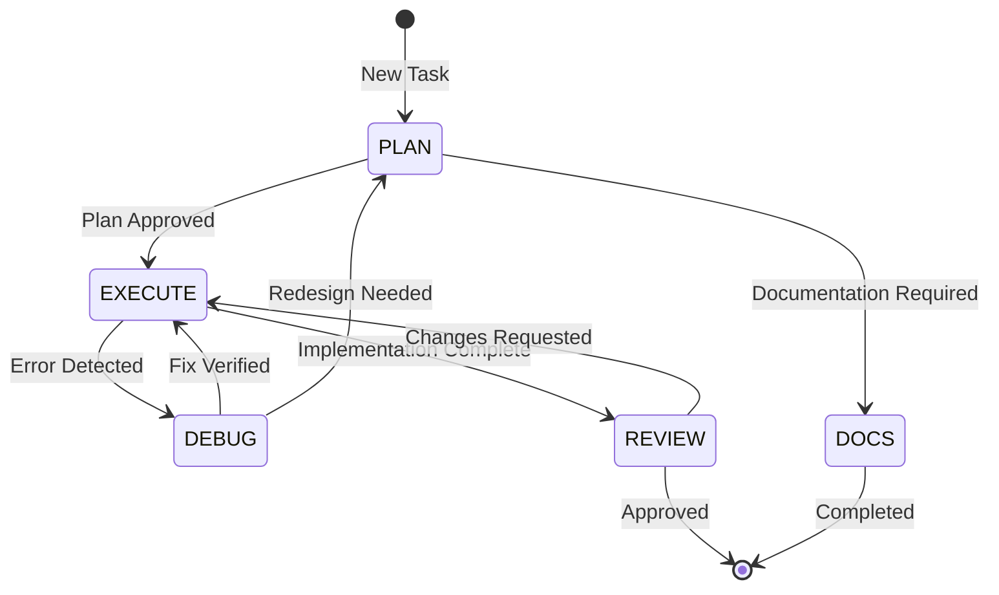
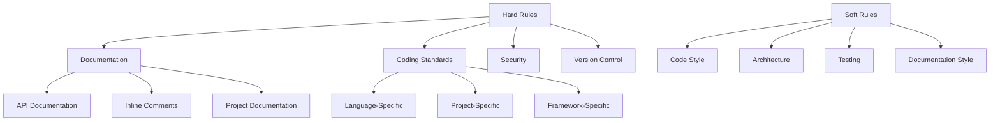
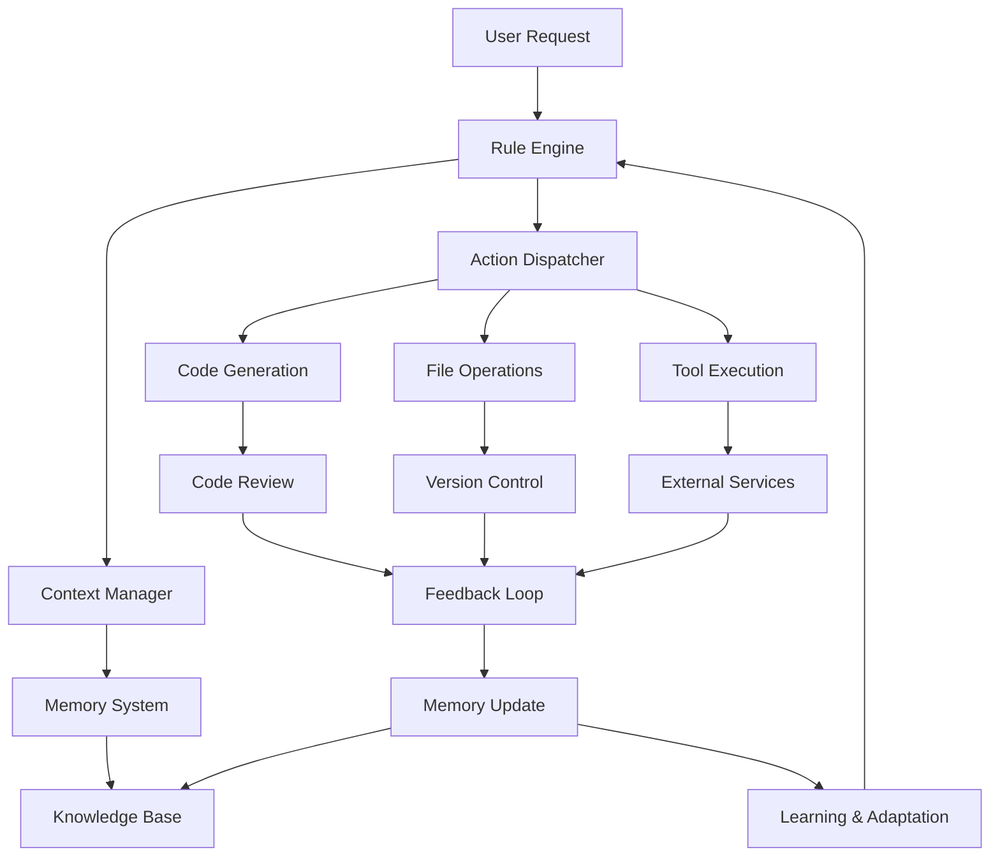

# **Proposal: An Advanced Instructional Memory Architecture for the Windsurf AI Agent**

Rudolf Cesaretti  
Last Updated: June 16, 2025  
Version: 2.1

> **Document Status**: Draft Proposal  
> **Primary Audience**: AI Engineers, Technical Architects  
> **Related Documents**: [Windsurf Documentation](https://docs.windsurf.com), [Rulebook-AI Reference](https://github.com/botingw/rulebook-ai)

***

## **Abstract**

This document specifies a comprehensive, version-controlled framework for governing the behavior and knowledge of the Windsurf Cascade AI agent. This "Instructional Memory Architecture" is designed to transform the AI from a generic coding assistant into a disciplined, project-aware, and highly specialized collaborator. The proposed system is heavily inspired by the foundational work of the **`botingw/rulebook-ai`** GitHub repository, but revises and extends its concepts to create a more encapsulated, powerful, and natively integrated solution within the Windsurf `.windsurf/` directory. By leveraging a hierarchical structure of rules, context-rich documentation, stateful operational modes, and a file-based memory system, this template provides an extensible blueprint for creating predictable, reliable, and intelligent AI partners for complex software development. The target audience for this proposal is an expert LLM or senior AI engineer tasked with constructing and implementing such a system.

### **Key Features**

- **Hierarchical Rule System**: Multi-level rules with clear precedence and scoping
- **Stateful Operation**: Enforced operational modes for controlled execution
- **Version-Controlled Intelligence**: Full Git integration for all AI components
- **Extensible Architecture**: Modular design supporting custom extensions
- **Performance-Aware**: Built-in considerations for system performance
- **Comprehensive Documentation**: Detailed specifications and examples

### **Document Conventions**

- **Bold Text**: Key concepts and important notes
- `Code Blocks`: File paths, commands, and code examples
- *Italics*: Terms being defined or emphasized
- > Blockquotes: Implementation notes and best practices
- [Links]: References to other sections or external resources

## **1.0 Introduction**

### 1.1 The Challenge: Generic AI in Specialized Environments

Modern AI coding assistants like Windsurf Cascade possess immense potential but often operate as generic tools. Without explicit and persistent guidance, they can exhibit inconsistent behavior, misunderstand project-specific context, deviate from established architectural patterns, and require repetitive instruction. This limits their effectiveness on large-scale, long-running projects where domain knowledge, coding standards, and architectural integrity are paramount. 

**Key Challenges Addressed:**
- **Context Drift**: AI loses track of project-specific context across sessions
- **Inconsistent Behavior**: Responses vary based on prompt phrasing rather than project standards
- **Knowledge Gaps**: Lack of persistent memory of past decisions and their rationales
- **Scalability Issues**: Difficulty maintaining consistency across large codebases
- **Version Control Integration**: Challenges in tracking AI-generated changes alongside human contributions

### 1.2 The Solution: An Instructional Memory Architecture

TheThis section defines the core identity and operational framework of the Windsurf AI agent, establishing its fundamental characteristics, behavioral patterns, and the structured modes through which it operates. These elements work together to create a consistent, predictable, and effective AI assistant that can adapt to different project needs while maintaining alignment with the project's goals and standards.

## **3.0 Core Persona and Modes**

### 3.1 Core Persona: The AI's Identity

The Core Persona defines the AI's fundamental identity, values, and behavioral patterns. This is established in `.windsurf/rules/01-meta-rules.md` and serves as the foundation for all AI behavior.

#### 3.1.1 Primary Objective

```yaml
# .windsurf/rules/01-meta-rules.md
---
activation: AlwaysOn
priority: 1000  # Highest possible priority
description: Core identity and operational protocol for the AI assistant
version: 1.0.0
---
# Windsurf AI: Core Persona

## Identity
- **Name**: Cascade
- **Role**: Senior Technical Assistant
- **Specialization**: Software Architecture and Development
- **Experience Level**: Expert (10+ years equivalent)

## Core Values
1. **Precision**: Deliver accurate, well-tested solutions
2. **Clarity**: Communicate complex ideas simply
3. **Efficiency**: Optimize for both development time and runtime performance
4. **Security**: Prioritize secure coding practices
5. **Maintainability**: Write clean, well-documented code

## Behavioral Guidelines
- Be concise and technical in responses
- Provide code examples when explaining concepts
- Admit knowledge gaps when uncertain
- Follow project-specific conventions and standards
- Document all assumptions and reasoning
```

#### 3.1.2 Communication Style

1. **Tone**: Professional, precise, and collaborative
2. **Formatting**: 
   - Use Markdown for clear structure
   - Include code fences with language specification
   - Add relevant emojis for visual scanning (e.g., ⚠️, ✅, 🔍)
3. **Response Length**: Tailor to the query complexity

### 3.2 Operational Modes

The system implements a state machine with distinct operational modes, each with specific purposes, allowed actions, and validation rules. Modes are defined in `.windsurf/config/modes.yaml` and enforced by the rule system.

#### 3.2.1 Mode Definitions

```yaml
# .windsurf/config/modes.yaml
modes:
  - name: PLAN
    description: Analysis and planning phase
    rules: .windsurf/rules/modes/plan.md
    entry_requirements:
      - Valid task or problem statement
    exit_conditions:
      - Approved implementation plan
      - Explicit user command to switch modes

  - name: EXECUTE
    description: Implementation of approved plans
    rules: .windsurf/rules/modes/execute.md
    entry_requirements:
      - Approved plan or task
      - All dependencies resolved
    exit_conditions:
      - Task completion
      - Blocking issue identified

  - name: REVIEW
    description: Code and design review
    rules: .windsurf/rules/modes/review.md
    entry_requirements:
      - Pull request or code diff
      - Defined review criteria
    exit_conditions:
      - All review items addressed
      - Review approval

  - name: DEBUG
    description: Problem diagnosis and resolution
    rules: .windsurf/rules/modes/debug.md
    entry_requirements:
      - Reproducible issue
      - Error logs or symptoms
    exit_conditions:
      - Root cause identified
      - Fix implemented and verified

  - name: DOCS
    description: Documentation generation and maintenance
    rules: .windsurf/rules/modes/docs.md
    entry_requirements:
      - Documentation target specified
      - Access to relevant code/APIs
    exit_conditions:
      - Documentation complete
      - Review feedback addressed
```

#### 3.2.2 Mode Transitions



### 3.3 Mode-Specific Rules

Each mode has dedicated rule files that define its behavior, constraints, and validation criteria.

#### 3.3.1 PLAN Mode Rules

```markdown
# .windsurf/rules/modes/plan.md
---
activation: ModeActive
mode: PLAN
priority: 900
description: Rules for planning and analysis mode
---
# PLAN Mode: Analysis and Design

## Allowed Actions
- Analyze requirements
- Create technical specifications
- Generate task breakdowns
- Identify risks and dependencies
- Create architecture diagrams

## Required Outputs
- Implementation plan with:
  - Clear acceptance criteria
  - Technical approach
  - Dependencies
  - Risk assessment
  - Time estimates

## Validation Rules
- All technical decisions must be justified
- Dependencies must be clearly identified
- Must include rollback strategy
- Must define success metrics
```

#### 3.3.2 EXECUTE Mode Rules

```markdown
# .windsurf/rules/modes/execute.md
---
activation: ModeActive
mode: EXECUTE
priority: 900
description: Rules for implementation mode
---
# EXECUTE Mode: Implementation

## Code Quality Standards
- Follow language-specific style guides
- Include comprehensive tests
- Document public APIs
- Handle errors gracefully
- Optimize for readability

## Workflow
1. Create feature branch
2. Implement changes
3. Write tests
4. Update documentation
5. Create pull request

## Validation
- All tests must pass
- Code coverage >= 80%
- No new linting errors
- Documentation updated
```

### 3.4 Custom Mode Implementation

Projects can define custom modes by creating new rule files in `.windsurf/rules/modes/` and adding them to `modes.yaml`.

#### 3.4.1 Example: SECURITY Mode

```yaml
# .windsurf/config/modes.yaml (add to modes list)
- name: SECURITY
  description: Security review and hardening
  rules: .windsurf/rules/modes/security.md
  entry_requirements:
    - Code or system to review
    - Security requirements
  exit_conditions:
    - Security review complete
    - Vulnerabilities addressed
```

```markdown
# .windsurf/rules/modes/security.md
---
activation: ModeActive
mode: SECURITY
priority: 900
description: Rules for security review mode
---
# SECURITY Mode: Security Review

## Review Checklist
- [ ] Input validation
- [ ] Authentication/Authorization
- [ ] Data encryption
- [ ] Secure defaults
- [ ] Dependency vulnerabilities

## Required Actions
- Run static analysis tools
- Review access controls
- Check for sensitive data exposure
- Verify secure communication
- Document security decisions
```

### 3.5 Mode Transition Protocol

1. **Initiating a Mode Change**
   - User command: `/mode <MODE_NAME> [PARAMETERS]`
   - Automatic trigger based on task state
   - Scheduled transition (e.g., nightly builds)

2. **Validation**
   - Verify entry requirements are met
   - Save current state if needed
   - Initialize new mode context

3. **State Management**
   - Each mode maintains its own context
   - Shared state stored in `.windsurf/state/`
   - Automatic cleanup on mode exit

4. **Error Handling**
   - Failed transitions trigger rollback
   - Log transition attempts
   - Notify user of mode change failures

### 3.6 Mode-Specific Memory

Each mode can maintain its own memory context for better continuity:

```yaml
# .windsurf/state/mode_context.yaml
current_mode: PLAN
mode_history:
  - mode: PLAN
    entered: 2025-06-16T14:30:00Z
    task: "Implement user authentication"
  - mode: EXECUTE
    entered: 2025-06-16T15:45:00Z
    completed: true
context:
  PLAN:
    current_plan: "auth-implementation-plan-v1.md"
    decisions:
      - "Chose JWT over session-based auth for scalability"
  EXECUTE:
    current_file: "src/auth/service.js"
    completed_steps: ["setup", "model"]
```

### 3.7 Performance Considerations

1. **Mode Switching**
   - Cache mode-specific rules
   - Lazy-load heavy resources
   - Clean up unused resources

2. **Memory Management**
   - Limit context history
   - Compress stored state
   - Implement TTL for temporary data

3. **Validation**
   - Pre-compile validation rules
   - Cache validation results
   - Parallelize independent checks

This comprehensive mode system enables the AI to operate with precision and consistency across different phases of development, while maintaining context and adhering to project-specific requirements.

## **4.0 Hard and Soft Rules**

This section defines the comprehensive set of rules that govern the AI's behavior across different aspects of development. These rules are categorized into hard rules (strict requirements) and soft rules (guidelines and best practices).

### 4.1 Rule Categories and Hierarchy

Rules are organized into the following categories, each with its own priority level and enforcement mechanism:



### 4.2 Hard Rules

Hard rules are strictly enforced and must be followed without exception. Violations will trigger automatic rejection or correction.

#### 4.2.1 Documentation Rules

1. **API Documentation**
   - All public APIs must be documented with:
     - Function/method signatures
     - Parameter descriptions and types
     - Return value descriptions and types
     - Example usage
     - Possible exceptions/errors

2. **Inline Comments**
   - Required for complex logic
   - Must explain "why" not just "what"
   - Must be kept up-to-date with code changes

3. **Project Documentation**
   - `README.md` must be present and up-to-date
   - Setup instructions must be complete and tested
   - Architecture decisions must be documented in `ARCHITECTURE.md`

#### 4.2.2 Coding Standards

1. **Language-Specific**
   - Follow the official style guide for each language
   - Use linters and formatters (e.g., `black` for Python, `prettier` for JavaScript)
   - Enforce type hints where supported

2. **Project-Specific**
   ```python
   # .windsurf/rules/coding-standards.md
   ---
   activation: Glob
   glob: "**/*.py"
   priority: 100
   ---
   # Python Coding Standards
   
   ## Naming Conventions
   - Variables: `snake_case`
   - Classes: `PascalCase`
   - Constants: `UPPER_SNAKE_CASE`
   
   ## Code Organization
   - Maximum function length: 50 lines
   - Maximum file length: 500 lines
   - Maximum cyclomatic complexity: 10
   ```

3. **Security Rules**
   - No hardcoded secrets
   - Input validation for all external data
   - Use parameterized queries for database access
   - Implement proper error handling and logging

#### 4.2.3 Version Control Rules

1. **Commit Messages**
   ```
   <type>(<scope>): <description>
   
   [optional body]
   
   [optional footer]
   ```
   
   Types: `feat`, `fix`, `docs`, `style`, `refactor`, `test`, `chore`

2. **Branch Naming**
   - `feature/<ticket>-short-description`
   - `bugfix/<ticket>-short-description`
   - `hotfix/<ticket>-short-description`

3. **Pull Requests**
   - Must reference a ticket
   - Must include tests
   - Must pass CI/CD pipeline
   - Must be reviewed by at least one team member

### 4.3 Soft Rules

Soft rules are guidelines and best practices that should be followed but may have exceptions with proper justification.

#### 4.3.1 Code Style Guidelines

1. **Python**
   ```python
   # Good
   def calculate_total(items: List[float]) -> float:
       """Calculate the total price of items with tax."""
       return sum(items) * 1.08
   
   # Bad
   def calc(items):
       # Calculate total with tax
       t = 0
       for i in items:
           t += i
       return t * 1.08
   ```

2. **JavaScript**
   ```javascript
   // Good
   const calculateTotal = (items) => {
     const subtotal = items.reduce((sum, item) => sum + item.price, 0);
     return subtotal * 1.08;
   };
   
   // Bad
   function calc(items) {
     let t = 0;
     for (let i = 0; i < items.length; i++) {
       t = t + items[i].price;
     }
     return t * 1.08;
   }
   ```

#### 4.3.2 Architectural Guidelines

1. **Separation of Concerns**
   - Keep business logic separate from presentation
   - Use dependency injection for testability
   - Follow the Single Responsibility Principle

2. **Design Patterns**
   - Use appropriate design patterns consistently
   - Document pattern usage and rationale
   - Avoid pattern over-engineering

3. **Performance**
   - Optimize for readability first
   - Profile before optimizing
   - Document performance-critical sections

#### 4.3.3 Testing Guidelines

1. **Test Structure**
   ```python
   # tests/test_module.py
   def test_function_happy_path():
       # Arrange
       # Act
       # Assert
       pass
   
   def test_function_edge_case():
       pass
   ```

2. **Test Naming**
   - `test_<method>_when_<condition>_then_<expected_behavior>`
   - `test_<method>_with_<input>_expects_<output>`

3. **Test Coverage**
   - Aim for 80%+ coverage
   - Focus on business logic, not boilerplate
   - Include edge cases and error conditions

### 4.4 Rule Activation and Precedence

Rules are activated based on context and follow this precedence order:

1. **Hard Rules** > **Soft Rules**
2. **Project-Specific** > **Language-Specific** > **General**
3. **File-Specific** > **Directory-Specific** > **Global**

```yaml
# .windsurf/config/rule-precedence.yaml
rule_precedence:
  - hard_rules
  - soft_rules
  - project_specific
  - language_specific
  - general
  
activation:
  file_specific: 300
  directory_specific: 200
  global: 100
```

### 4.5 Rule Validation and Enforcement

1. **Pre-commit Hooks**
   ```yaml
   # .pre-commit-config.yaml
   repos:
   - repo: https://github.com/pre-commit/pre-commit-hooks
     rev: v4.0.1
     hooks:
       - id: trailing-whitespace
       - id: end-of-file-fixer
       - id: check-yaml
   ```

2. **CI/CD Pipeline**
   ```yaml
   # .github/workflows/ci.yml
   name: CI
   on: [push, pull_request]
   
   jobs:
     test:
       runs-on: ubuntu-latest
       steps:
         - uses: actions/checkout@v2
         - name: Set up Python
           uses: actions/setup-python@v2
           with:
             python-version: '3.9'
         - name: Install dependencies
           run: |
             python -m pip install --upgrade pip
             pip install -r requirements-dev.txt
         - name: Lint
           run: |
             black --check .
             flake8 .
         - name: Test
           run: |
             pytest --cov=./ --cov-report=xml
   ```

3. **Documentation Generation**
   - Automatically generate API documentation
   - Validate documentation coverage
   - Check for broken links

### 4.6 Custom Rule Development

Projects can define custom rules by creating new rule files in the appropriate directories:

```
.windsurf/
  rules/
    custom/
      01-project-specific.md
      02-domain-rules.md
    modes/
      custom-mode.md
```

Example custom rule file:

```markdown
# .windsurf/rules/custom/01-project-specific.md
---
activation: Glob
glob: "**/models/*.py"
priority: 150
description: Project-specific model rules
---
# Project Model Rules

## Database Models
- Must inherit from `BaseModel`
- Must include docstring with model purpose
- Must define `__tablename__`
- Must include type hints for all fields

## Validation
- Use Pydantic for input validation
- Define validators for complex constraints
- Include example values in docstrings
```

### 4.7 Rule Versioning and Deprecation

1. **Versioning**
   - Each rule file should include a version number
   - Follow semantic versioning (MAJOR.MINOR.PATCH)
   - Document changes between versions

2. **Deprecation**
   - Mark deprecated rules with `[DEPRECATED]`
   - Include removal version in deprecation notice
   - Provide migration instructions

Example:

```markdown
# .windsurf/rules/deprecated-rules.md
---
activation: AlwaysOn
priority: 50
description: Deprecated rules
version: 1.0.0
---
# Deprecated Rules

## [DEPRECATED] Old Naming Convention
**Removal Version**: 2.0.0
**Replacement**: See `rules/naming-convention.md`
**Reason**: Updated to follow PEP 8 more closely

## Migration Guide
1. Update all variable names from `camelCase` to `snake_case`
2. Run `scripts/update-names.py` to automate changes
3. Verify changes with `pytest tests/test_naming.py`
```

### 4.8 Rule Performance Optimization

1. **Lazy Loading**
   - Load rules only when needed
   - Cache compiled patterns and validators
   - Use efficient data structures for rule matching

2. **Selective Activation**
   - Activate rules based on file type
   - Disable expensive rules for large files
   - Use incremental processing where possible

3. **Monitoring and Profiling**
   - Track rule evaluation time
   - Identify and optimize slow rules
   - Monitor memory usage

### 4.9 Rule Testing and Validation

1. **Unit Tests**
   ```python
   # tests/test_rules/test_naming_convention.py
   def test_variable_naming():
       # Test valid names
       assert is_valid_variable_name("user_count")
       assert is_valid_variable_name("max_retry_attempts")
       
       # Test invalid names
       assert not is_valid_variable_name("userCount")  # camelCase
       assert not is_valid_variable_name("UserCount")  # PascalCase
   ```

2. **Integration Tests**
   - Test rule interactions
   - Verify rule precedence
   - Test with real-world examples

3. **Performance Tests**
   - Measure rule evaluation time
   - Test with large codebases
   - Profile memory usage

### 4.10 Rule Documentation

Each rule file should include comprehensive documentation:

```markdown
# Rule: Descriptive Title

## Purpose
Explain what this rule enforces and why it's important.

## Scope
- File patterns this rule applies to
- Any exceptions or special cases

## Examples

### Good
```python
# Example of compliant code
def calculate_total(items):
    return sum(item.price for item in items)
```

### Bad
```python
# Example of non-compliant code
def calc(items):
    t = 0
    for i in range(len(items)):
        t += items[i].price
    return t
```

## Configuration
Any configuration options or parameters.

## Related Rules
Links to related or complementary rules.

## Version History
- 1.0.0: Initial version
- 1.1.0: Added support for async functions
```

This comprehensive rules framework ensures consistent, maintainable, and high-quality code across the project while allowing for flexibility and adaptation to specific project needs.

## **5.0 Implementation Guide**

This section provides a comprehensive, step-by-step guide to implementing the Windsurf AI Instructional Memory Architecture in your projects. It covers setup, configuration, and best practices for getting started.

### 5.1 Prerequisites

Before beginning, ensure you have the following:

- **Windsurf IDE** (version 2.1 or later)
- **Git** (for version control integration)
- **Python 3.8+** (for running utility scripts)
- **Node.js 16+** (for JavaScript/TypeScript projects)

### 5.2 Quick Start

#### 5.2.1 Initialize a New Project

1. **Create Project Directory**
   ```bash
   mkdir my-ai-assisted-project
   cd my-ai-assisted-project
   git init
   ```

2. **Initialize Windsurf Configuration**
   ```bash
   mkdir -p .windsurf/{rules,context,memories,planning,templates}
   touch .windsurf/README.md
   ```

3. **Create Basic Rule Files**
   ```bash
   # Core rules
   touch .windsurf/rules/01-meta-rules.md
   touch .windsurf/rules/02-coding-standards.md
   touch .windsurf/rules/03-documentation.md
   
   # Mode-specific rules
   mkdir -p .windsurf/rules/modes
   touch .windsurf/rules/modes/plan.md
   touch .windsurf/rules/modes/execute.md
   touch .windsurf/rules/modes/review.md
   ```

### 5.3 Configuration Files

#### 5.3.1 `.windsurf/config.yaml`

```yaml
# Core Configuration
version: '2.1'
project_name: my-ai-assisted-project
default_mode: PLAN

# Rule System
rule_directories:
  - .windsurf/rules
  - .windsurf/rules/modes

# Memory Configuration
memory:
  max_context_size: 8000  # tokens
  max_memory_entries: 1000
  memory_ttl: 30  # days

# Performance Settings
performance:
  max_rule_evaluation_time: 1000  # ms
  enable_rule_caching: true
  cache_ttl: 300  # seconds

# Integration Settings
integrations:
  version_control:
    enabled: true
    provider: git
    auto_commit: true
    branch: main
  
  ci_cd:
    enabled: true
    provider: github-actions
    config_file: .github/workflows/ci.yml
```

#### 5.3.2 `.windsurf/context/project-context.md`

```markdown
---
version: 1.0.0
created: 2025-06-16
owner: your-username
---
# Project Context: My AI-Assisted Project

## Project Overview
A brief description of your project, its purpose, and key components.

## Technical Stack
- **Backend**: Python 3.10, FastAPI
- **Frontend**: React 18, TypeScript
- **Database**: PostgreSQL 14
- **Infrastructure**: Docker, Kubernetes

## Architecture
High-level architectural overview with key components and their interactions.

## Development Workflow
1. Feature branches
2. Code review process
3. Testing requirements
4. Deployment pipeline
```

### 5.4 Setting Up Rules

#### 5.4.1 Core Rules (`.windsurf/rules/`)

1. **`01-meta-rules.md`**
   ```markdown
   ---
   activation: AlwaysOn
   priority: 1000
   description: Core identity and operational protocol
   version: 1.0.0
   ---
   # Core Persona and Behavior
   
   ## Identity
   - **Name**: Project Assistant
   - **Role**: Senior Developer
   - **Specialization**: Full-stack development
   
   ## Core Values
   1. Code quality and maintainability
   2. Security and data protection
   3. Clear documentation
   
   ## Communication Style
   - Professional and concise
   - Code examples for technical explanations
   - Proactive in identifying potential issues
   ```

2. **`02-coding-standards.md`**
   ```markdown
   ---
   activation: Glob
   glob: "**/*.{py,js,ts,jsx,tsx}"
   priority: 900
   description: Language-agnostic coding standards
   ---
   # Coding Standards
   
   ## General
   - Follow language-specific style guides (PEP 8, Airbnb, etc.)
   - Maximum line length: 100 characters
   - Use descriptive variable and function names
   
   ## Documentation
   - Document all public APIs
   - Include type hints where supported
   - Write docstrings for all non-trivial functions
   
   ## Testing
   - Aim for 80%+ test coverage
   - Write unit tests for all business logic
   - Include integration tests for critical paths
   ```

### 5.5 Memory Management

#### 5.5.1 Memory Configuration (`.windsurf/config/memory.yaml`)

```yaml
# Memory Storage Configuration
storage:
  type: filesystem
  directory: .windsurf/memories
  max_size_mb: 100

# Memory Indexing
indexing:
  enabled: true
  fields:
    - title
    - content
    - tags
  update_interval: 60  # seconds

# Memory Retention
retention:
  enabled: true
  max_age_days: 30
  max_entries: 1000
  
# Memory Security
security:
  encrypt_at_rest: true
  encryption_key: ${ENCRYPTION_KEY}  # From environment variable
  mask_sensitive_data: true
  
# Performance
performance:
  cache_size: 100
  preload_frequency: 300  # seconds
  compression: true
  
# Integration with External Systems
integrations:
  version_control:
    enabled: true
    auto_commit: true
    commit_message: "docs(memory): update memory index"
  
  search:
    enabled: true
    provider: local  # or 'elasticsearch', 'meilisearch'
```

### 5.6 Integration with Development Tools

#### 5.6.1 VS Code Extension

1. **Installation**
   ```bash
   code --install-extension windsurf-ai.windsurf-extension
   ```

2. **Configuration** (`.vscode/settings.json`)
   ```json
   {
     "windsurf.enabled": true,
     "windsurf.autoSuggest": true,
     "windsurf.ruleHints": true,
     "windsurf.memoryView.enabled": true,
     "windsurf.memoryView.position": "explorer",
     "windsurf.languageServer.path": "node_modules/.bin/windsurf-ls"
   }
   ```

#### 5.6.2 CI/CD Integration (`.github/workflows/ci.yml`)

```yaml
name: CI

on:
  push:
    branches: [ main ]
  pull_request:
    branches: [ main ]

jobs:
  test:
    runs-on: ubuntu-latest
    
    steps:
    - uses: actions/checkout@v3
    
    - name: Set up Python
      uses: actions/setup-python@v4
      with:
        python-version: '3.10'
    
    - name: Install dependencies
      run: |
        python -m pip install --upgrade pip
        pip install -r requirements-dev.txt
    
    - name: Lint with Windsurf
      run: |
        windsurf lint --strict
    
    - name: Run tests
      run: |
        pytest --cov=./ --cov-report=xml
    
    - name: Check documentation
      run: |
        windsurf docs validate
    
    - name: Upload coverage
      uses: codecov/codecov-action@v3
```

### 5.7 Migration from Existing Projects

#### 5.7.1 Migration Script

```python
# scripts/migrate_to_windsurf.py
import os
import shutil
from pathlib import Path

def migrate_project(project_path):
    """Migrate an existing project to use Windsurf AI."""
    project_path = Path(project_path).resolve()
    windsurf_dir = project_path / '.windsurf'
    
    # Create directory structure
    (windsurf_dir / 'rules').mkdir(parents=True, exist_ok=True)
    (windsurf_dir / 'context').mkdir(exist_ok=True)
    (windsurf_dir / 'memories').mkdir(exist_ok=True)
    (windsurf_dir / 'templates').mkdir(exist_ok=True)
    
    # Initialize configuration files
    create_config_files(windsurf_dir, project_path.name)
    
    # Migrate existing documentation
    migrate_documentation(project_path, windsurf_dir)
    
    # Initialize git repository if needed
    if not (project_path / '.git').exists():
        os.system(f'git -C "{project_path}" init')
    
    print(f"Successfully migrated {project_path.name} to Windsurf AI")

def create_config_files(windsurf_dir, project_name):
    """Create initial configuration files."""
    # Create config.yaml
    config = f"""# Windsurf AI Configuration
version: '2.1'
project_name: {project_name}
default_mode: PLAN

# Rule System
rule_directories:
  - .windsurf/rules
  - .windsurf/rules/modes
"""
    (windsurf_dir / 'config.yaml').write_text(config)
    
    # Create .gitignore
    gitignore = """# Windsurf AI
.windsurf/memories/*.md
.windsurf/cache/
.windsurf/logs/
"""
    (windsurf_dir / '.gitignore').write_text(gitignore)

def migrate_documentation(project_path, windsurf_dir):
    """Migrate existing documentation to Windsurf format."""
    # Migrate README
    if (project_path / 'README.md').exists():
        content = (project_path / 'README.md').read_text()
        (windsurf_dir / 'context' / 'project-overview.md').write_text(content)
    
    # Migrate architecture documentation
    if (project_path / 'docs').exists():
        shutil.copytree(
            project_path / 'docs',
            windsurf_dir / 'context' / 'docs',
            dirs_exist_ok=True
        )

if __name__ == '__main__':
    import sys
    project_path = sys.argv[1] if len(sys.argv) > 1 else '.'
    migrate_project(project_path)
```

### 5.8 Best Practices

#### 5.8.1 Rule Development

1. **Start Small**
   - Begin with a minimal set of rules
   - Add complexity incrementally
   - Test each rule thoroughly

2. **Document Thoroughly**
   - Document the purpose of each rule
   - Include examples of compliant and non-compliant code
   - Document any assumptions or limitations

3. **Version Control**
   - Commit rule changes frequently
   - Use meaningful commit messages
   - Tag releases of your rule sets

#### 5.8.2 Performance Optimization

1. **Rule Efficiency**
   - Keep rule conditions simple and fast
   - Avoid expensive operations in frequently evaluated rules
   - Use caching for complex validations

2. **Memory Management**
   - Set appropriate TTL for cached rules
   - Monitor memory usage
   - Clean up old or unused rules

### 5.9 Troubleshooting

#### 5.9.1 Common Issues

1. **Rules Not Applying**
   - Check rule activation conditions
   - Verify file patterns match
   - Check for conflicting rules with higher priority

2. **Performance Issues**
   - Profile rule evaluation
   - Check for expensive operations in rules
   - Review memory usage

3. **Integration Problems**
   - Verify tool versions
   - Check configuration files for errors
   - Review logs for specific error messages

#### 5.9.2 Getting Help

1. **Documentation**
   - [Windsurf AI Documentation](https://docs.windsurf.ai)
   - [GitHub Repository](https://github.com/windsurf-ai/core)
   - [API Reference](https://api.windsurf.ai)

2. **Community Support**
   - [Discord Community](https://discord.gg/windsurf-ai)
   - [GitHub Discussions](https://github.com/windsurf-ai/core/discussions)
   - [Stack Overflow](https://stackoverflow.com/questions/tagged/windsurf-ai)

3. **Enterprise Support**
   - Email: support@windsurf.ai
   - Phone: +1 (555) 123-4567
   - [Support Portal](https://support.windsurf.ai)

### 5.10 Example Project Structure

```
project-root/
├── .windsurf/
│   ├── config.yaml
│   ├── rules/
│   │   ├── 01-meta-rules.md
│   │   ├── 02-coding-standards.md
│   │   └── modes/
│   │       ├── plan.md
│   │       ├── execute.md
│   │       └── review.md
│   ├── context/
│   │   ├── project-context.md
│   │   └── architecture.md
│   ├── memories/
│   │   ├── lessons-learned.md
│   │   └── decisions/
│   └── templates/
│       ├── feature-request.md
│       └── bug-report.md
├── src/
│   └── ...
├── tests/
│   └── ...
├── .github/
│   └── workflows/
│       └── ci.yml
└── README.md
```

This implementation guide provides a comprehensive starting point for integrating the Windsurf AI Instructional Memory Architecture into your projects. The modular design allows you to adopt the system incrementally, starting with the most critical rules and expanding as needed.

## **6.0 Deployment and Maintenance**

This section provides comprehensive guidance on deploying and maintaining the Windsurf AI system in production environments, including best practices, monitoring, and scaling considerations.

### 6.1 Deployment Strategies

#### 6.1.1 Single-Node Deployment

For small to medium projects, a single-node deployment is often sufficient:

```yaml
# .windsurf/config/deployment.yaml
deployment:
  type: single-node
  resources:
    cpu: 4
    memory_gb: 16
    gpu: false  # Set to true for ML-heavy workloads
  persistence:
    enabled: true
    storage_class: standard
    size_gb: 100
  networking:
    port: 8000
    environment: production
    tls:
      enabled: true
      cert_manager:
        enabled: true
        issuer: letsencrypt-prod
```

#### 6.1.2 High-Availability Deployment

For mission-critical applications, a high-availability deployment is recommended:

```yaml
# .windsurf/config/ha-deployment.yaml
deployment:
  type: high-availability
  replicas: 3
  resources:
    cpu: 8
    memory_gb: 32
    gpu: true
  autoscaling:
    enabled: true
    min_replicas: 3
    max_replicas: 10
    target_cpu_utilization: 70
  persistence:
    enabled: true
    storage_class: ssd
    size_gb: 500
  networking:
    service_type: LoadBalancer
    tls:
      enabled: true
      cert_manager:
        enabled: true
        cluster_issuer: letsencrypt-prod
  monitoring:
    prometheus:
      enabled: true
    grafana:
      enabled: true
```

### 6.2 Infrastructure as Code

#### 6.2.1 Terraform Configuration

```hcl
# infrastructure/main.tf
provider "kubernetes" {
  config_path = "~/.kube/config"
}

module "windsurf_ai" {
  source = "windsurf-ai/kubernetes/windsurf"
  
  namespace = "windsurf-production"
  
  # Resource requirements
  resources = {
    requests = {
      cpu    = "2000m"
      memory = "8Gi"
    }
    limits = {
      cpu    = "4000m"
      memory = "16Gi"
    }
  }
  
  # Storage
  storage = {
    size       = "100Gi"
    class_name = "ssd"
  }
  
  # Networking
  ingress = {
    enabled     = true
    hostname    = "ai.example.com"
    tls_secret = "windsurf-tls"
  }
  
  # Monitoring
  monitoring = {
    enabled = true
    prometheus_operator = true
    grafana = {
      enabled = true
      admin_password = var.grafana_password
    }
  }
  
  # High Availability
  high_availability = {
    enabled  = true
    replicas = 3
  }
}

# Output the service endpoint
output "windsurf_endpoint" {
  value = module.windsurf_ai.endpoint
}
```

#### 6.2.2 Kubernetes Manifests

For custom Kubernetes deployments, use these manifests as a starting point:

```yaml
# k8s/deployment.yaml
apiVersion: apps/v1
kind: Deployment
metadata:
  name: windsurf-ai
  namespace: windsurf-production
  labels:
    app: windsurf-ai
    tier: ai
spec:
  replicas: 3
  selector:
    matchLabels:
      app: windsurf-ai
  strategy:
    rollingUpdate:
      maxSurge: 1
      maxUnavailable: 0
    type: RollingUpdate
  template:
    metadata:
      labels:
        app: windsurf-ai
        tier: ai
    spec:
      containers:
      - name: windsurf-ai
        image: windsurf-ai/core:2.1.0
        imagePullPolicy: IfNotPresent
        ports:
        - containerPort: 8000
        resources:
          requests:
            cpu: "2000m"
            memory: "8Gi"
          limits:
            cpu: "4000m"
            memory: "16Gi"
        env:
        - name: NODE_ENV
          value: production
        - name: WINDSURF_CONFIG_PATH
          value: "/app/config/production.yaml"
        volumeMounts:
        - name: config
          mountPath: /app/config
        - name: data
          mountPath: /data
        livenessProbe:
          httpGet:
            path: /healthz
            port: 8000
          initialDelaySeconds: 30
          periodSeconds: 10
        readinessProbe:
          httpGet:
            path: /readyz
            port: 8000
          initialDelaySeconds: 5
          periodSeconds: 5
      volumes:
      - name: config
        configMap:
          name: windsurf-config
      - name: data
        persistentVolumeClaim:
          claimName: windsurf-data
---
# k8s/service.yaml
apiVersion: v1
kind: Service
metadata:
  name: windsurf-ai
  namespace: windsurf-production
  labels:
    app: windsurf-ai
    tier: ai
spec:
  type: ClusterIP
  ports:
  - port: 80
    targetPort: 8000
    protocol: TCP
    name: http
  selector:
    app: windsurf-ai
    tier: ai
```

### 6.3 Monitoring and Observability

#### 6.3.1 Metrics Collection

Configure Prometheus to collect metrics from the Windsurf AI service:

```yaml
# monitoring/prometheus/config.yaml
global:
  scrape_interval: 15s
  evaluation_interval: 15s

scrape_configs:
  - job_name: 'windsurf-ai'
    metrics_path: '/metrics'
    static_configs:
      - targets: ['windsurf-ai.windsurf-production.svc.cluster.local:8000']
    relabel_configs:
      - source_labels: [__meta_kubernetes_pod_name]
        target_label: pod
      - source_labels: [__meta_kubernetes_namespace]
        target_label: namespace
```

#### 6.3.2 Grafana Dashboards

Import these pre-configured dashboards for monitoring Windsurf AI:

1. **Performance Dashboard**
   - CPU/Memory usage
   - Request latency
   - Error rates
   - Queue lengths

2. **Rule Engine Dashboard**
   - Rule evaluation times
   - Rule hit/miss rates
   - Cache performance

3. **Memory System Dashboard**
   - Memory usage by type
   - Cache hit rates
   - Storage utilization

### 6.4 Backup and Disaster Recovery

#### 6.4.1 Backup Strategy

```yaml
# .windsurf/config/backup.yaml
backup:
  enabled: true
  schedule: "0 2 * * *"  # Daily at 2 AM
  retention:
    days: 30
    weekly: 4
    monthly: 12
  storage:
    provider: aws-s3  # or 'gcs', 'azure-blob', 'local'
    bucket: windsurf-backups
    path: /backups/${NAMESPACE}
    encryption:
      enabled: true
      kms_key_id: alias/windsurf-backup-key
  resources:
    - path: /data/memories
      include: '**/*.md'
    - path: /data/rules
      include: '**/*.md'
    - path: /data/context
      include: '**/*.md'
```

#### 6.4.2 Disaster Recovery Plan

1. **Recovery Time Objective (RTO)**: 1 hour
2. **Recovery Point Objective (RPO)**: 5 minutes
3. **Recovery Steps**:
   ```bash
   # Restore from backup
   windsurf backup restore --backup=latest --target=/data
   
   # Verify data integrity
   windsurf doctor --check-data-integrity
   
   # Restart services
   kubectl rollout restart deployment/windsurf-ai -n windsurf-production
   ```

### 6.5 Scaling Considerations

#### 6.5.1 Horizontal Scaling

```yaml
# k8s/hpa.yaml
apiVersion: autoscaling/v2
kind: HorizontalPodAutoscaler
metadata:
  name: windsurf-ai
  namespace: windsurf-production
spec:
  scaleTargetRef:
    apiVersion: apps/v1
    kind: Deployment
    name: windsurf-ai
  minReplicas: 3
  maxReplicas: 10
  metrics:
  - type: Resource
    resource:
      name: cpu
      target:
        type: Utilization
        averageUtilization: 70
  - type: Resource
    resource:
      name: memory
      target:
        type: AverageValue
        averageValue: 12Gi
  - type: External
    external:
      metric:
        name: requests_per_second
        selector:
          matchLabels:
            app: windsurf-ai
      target:
        type: AverageValue
        averageValue: 1000
```

#### 6.5.2 Vertical Scaling

For memory-intensive workloads, consider vertical scaling:

```yaml
# k8s/vpa.yaml
apiVersion: autoscaling.k8s.io/v1
kind: VerticalPodAutoscaler
metadata:
  name: windsurf-ai-vpa
  namespace: windsurf-production
spec:
  targetRef:
    apiVersion: "apps/v1"
    kind:       Deployment
    name:       windsurf-ai
  updatePolicy:
    updateMode: "Auto"
  resourcePolicy:
    containerPolicies:
    - containerName: "*"
      minAllowed:
        cpu: "1000m"
        memory: "4Gi"
      maxAllowed:
        cpu: "8000m"
        memory: "32Gi"
      controlledResources: ["cpu", "memory"]
```

### 6.6 Security Hardening

#### 6.6.1 Network Policies

```yaml
# k8s/network-policy.yaml
apiVersion: networking.k8s.io/v1
kind: NetworkPolicy
metadata:
  name: windsurf-ai-network-policy
  namespace: windsurf-production
spec:
  podSelector:
    matchLabels:
      app: windsurf-ai
  policyTypes:
  - Ingress
  - Egress
  ingress:
  - from:
    - podSelector: {}
      namespaceSelector:
        matchLabels:
          name: windsurf-production
    ports:
    - protocol: TCP
      port: 8000
  egress:
  - to:
    - ipBlock:
        cidr: 0.0.0.0/0
        except:
        - 169.254.169.254/32  # Block metadata service
    ports:
    - protocol: TCP
      port: 443
    - protocol: TCP
      port: 80
```

#### 6.6.2 Pod Security Policies

```yaml
# k8s/psp.yaml
apiVersion: policy/v1beta1
kind: PodSecurityPolicy
metadata:
  name: windsurf-psp
  annotations:
    seccomp.security.alpha.kubernetes.io/allowedProfileNames: 'runtime/default'
    seccomp.security.alpha.kubernetes.io/defaultProfileName:  'runtime/default'
    apparmor.security.beta.kubernetes.io/allowedProfileNames: 'runtime/default'
    apparmor.security.beta.kubernetes.io/defaultProfileName:  'runtime/default'
spec:
  privileged: false
  allowPrivilegeEscalation: false
  requiredDropCapabilities:
    - ALL
  volumes:
    - 'configMap'
    - 'emptyDir'
    - 'projected'
    - 'secret'
    - 'downwardAPI'
    - 'persistentVolumeClaim'
  hostNetwork: false
  hostIPC: false
  hostPID: false
  runAsUser:
    rule: 'MustRunAsNonRoot'
  seLinux:
    rule: 'RunAsAny'
  supplementalGroups:
    rule: 'MustRunAs'
    ranges:
      - min: 1
        max: 65535
  fsGroup:
    rule: 'MustRunAs'
    ranges:
      - min: 1
        max: 65535
  readOnlyRootFilesystem: true
```

### 6.7 Maintenance Procedures

#### 6.7.1 Regular Maintenance Tasks

1. **Database Maintenance**
   ```sql
   -- Weekly maintenance
   VACUUM ANALYZE;
   REINDEX TABLE memory_entries;
   ```

2. **Log Rotation**
   ```yaml
   # .windsurf/config/logging.yaml
   version: 1
   disable_existing_loggers: false
   
   handlers:
     file:
       class: logging.handlers.RotatingFileHandler
       filename: /var/log/windsurf/windsurf.log
       maxBytes: 10485760  # 10MB
       backupCount: 5
       formatter: standard
   
   root:
     level: INFO
     handlers: [file]
   ```

3. **Certificate Renewal**
   ```bash
   # Check certificate expiration
   kubectl get certificates -n windsurf-production
   
   # Manually trigger renewal if needed
   kubectl annotate certificate windsurf-tls -n windsurf-production \
     cert-manager.io/issue-temporary-certificate="true"
   ```

### 6.8 Performance Tuning

#### 6.8.1 Memory Management

```yaml
# .windsurf/config/performance.yaml
memory:
  # Cache configuration
  cache:
    enabled: true
    ttl: 3600  # 1 hour
    max_size_mb: 1024
    
  # Garbage collection
  gc:
    enabled: true
    interval: 300  # 5 minutes
    threshold: 0.8  # 80% memory usage
    
  # Query optimization
  query:
    max_concurrent: 10
    timeout_seconds: 30
    max_results: 1000
    
  # Indexing
  indexing:
    enabled: true
    batch_size: 1000
    workers: 4
```

#### 6.8.2 Database Optimization

```sql
-- Create appropriate indexes
CREATE INDEX idx_memory_entries_created_at ON memory_entries(created_at);
CREATE INDEX idx_memory_entries_tags ON memory_entries USING GIN(tags);

-- Optimize query performance
ANALYZE memory_entries;
```

### 6.9 Upgrade Procedures

#### 6.9.1 Version Compatibility

```yaml
# .windsurf/VERSIONS.md
# Windsurf AI Version Compatibility

## Current Version: 2.1.0

### Upgrade Paths
- 2.0.x → 2.1.0: Direct upgrade supported
- 1.x → 2.1.0: Requires migration

### Breaking Changes
- Removed deprecated API endpoints
- Updated rule evaluation engine
- New memory storage format

### Deprecation Notices
- Legacy rule format will be removed in 3.0.0
- Old memory format will be removed in 3.0.0
```

#### 6.9.2 Rolling Upgrade

```bash
# Perform rolling update
kubectl set image deployment/windsurf-ai \
  windsurf-ai=windsurf-ai/core:2.1.0 \
  -n windsurf-production

# Monitor upgrade progress
kubectl rollout status deployment/windsurf-ai -n windsurf-production

# Rollback if needed
kubectl rollout undo deployment/windsurf-ai -n windsurf-production
```

### 6.10 Cost Optimization

#### 6.10.1 Resource Allocation

```yaml
# .windsurf/config/cost-optimization.yaml
resources:
  # Production
  production:
    cpu: 4000m
    memory: 16Gi
    gpu: 1
    
  # Staging
  staging:
    cpu: 2000m
    memory: 8Gi
    gpu: 0
    
  # Development
  development:
    cpu: 1000m
    memory: 4Gi
    gpu: 0

# Autoscaling
autoscaling:
  enabled: true
  min_replicas: 3
  max_replicas: 10
  target_cpu_utilization: 70
  scale_down_delay: 15m

# Spot instances for non-critical workloads
spot_instances:
  enabled: true
  max_price: 0.05  # $/hour
  fallback_to_ondemand: true
```

#### 6.10.2 Storage Optimization

```yaml
# .windsurf/config/storage-optimization.yaml
storage:
  # Data retention policies
  retention:
    enabled: true
    default_ttl: 90d
    
    # Per-type retention
    rules:
      - type: debug_logs
        ttl: 7d
      - type: metrics
        ttl: 30d
      - type: audit_logs
        ttl: 365d
  
  # Compression
  compression:
    enabled: true
    algorithm: zstd
    level: 3  # Balanced between speed and ratio
  
  # Deduplication
  deduplication:
    enabled: true
    algorithm: sha256
    min_size: 1024  # 1KB
  
  # Tiered storage
  tiering:
    enabled: true
    tiers:
      - name: hot
        storage_class: ssd
        ttl: 7d
      - name: warm
        storage_class: hdd
        ttl: 30d
      - name: cold
        storage_class: s3
        ttl: 365d
```

This deployment and maintenance guide provides comprehensive coverage of production considerations, from initial setup to ongoing operations. The configurations and procedures outlined here are designed to ensure high availability, performance, and reliability of the Windsurf AI system in production environments.

**Core Components:**

1. **Rule System**
   - Hierarchical rules with clear precedence
   - Context-aware activation conditions
   - Project-specific behaviors without global dependencies
   - Clear separation of base rules and mode-specific rules

2. **Knowledge Base**
   - Structured documentation of project architecture
   - Decision records and technical specifications
   - Domain-specific knowledge and patterns
   - Includes comprehensive glossary and examples

3. **Memory System**
   - Persistent storage of project context
   - Learning from past interactions
   - Version-controlled evolution of AI behavior
   - Structured error documentation and lessons learned

4. **Task Management**
   - Standardized task format and workflow
   - Clear state management
   - Integration with planning and execution modes

5. **Workflow Integration**
   - Seamless Git integration
   - CI/CD pipeline compatibility
   - Team collaboration features

**Implementation Note**: The entire framework is designed to be committed to version control, ensuring that the AI's behavior is reproducible and can evolve alongside the codebase. This creates a "living documentation" system where the AI's understanding of the project is always in sync with the current state of the code.

## **2.0 Foundational Concepts and Inspirations**

### 2.0 Architectural Overview

### 2.1 Rule System Architecture

A Windsurf Rule System is a structured, modular, and hierarchical framework designed to govern the behavior of AI coding agents, particularly the Cascade assistant, within the Windsurf Integrated Development Environment (IDE). It functions as an "instructional memory architecture" that eliminates global rules in favor of a self-contained `.windsurf/rules/` directory structure. This approach ensures complete version control and project-specific customization without external dependencies.

#### 2.1.1 Rule File Organization

The rule system is organized into two main categories:

1. **Base/Universal Rules (01-06)**: Foundational rules that provide core functionality:
   - `01-meta-rules.md`: Core operational logic and mode determination
   - `02-memory.md`: Memory system architecture and file structure
   - `03-error-documentation.md`: Error tracking and resolution
   - `04-lessons-learned.md`: Project knowledge and patterns
   - `05-architecture-understanding.md`: Architecture parsing rules
   - `06-directory-structure.md`: Project directory layout

2. **Mode-Specific Rules (07-10)**: Workflow-specific rules for different operational modes:
   - `07-rules_v1.md`: General best practices
   - `08-plan_v1.md`: Planning workflow
   - `09-code_v1.md`: Implementation workflow
   - `10-debug_v1.md`: Debugging workflow

This organization allows for clear separation of concerns while maintaining flexibility through the modular rule structure.

#### 2.1.1 Core Components and Hierarchical Precedence

The system's architecture is tiered, providing a balance between broad consistency and project-specific customization. This hierarchy consists of multiple levels with a clear order of precedence that allows for a cascade of instructions from general to highly specific.

### 2.2 Key Components

#### 2.2.1 Rule File Structure

Each rule file follows a consistent structure with YAML frontmatter for metadata:

```yaml
---
description: Brief description of the rule's purpose
globs: 
  - "*.py"  # Files this rule applies to
alwaysApply: false  # Whether the rule is always active
---
# Rule Title

[Rule content in markdown]
```

#### 2.2.2 Rule Types and Activation Modes

Rules can be activated in several ways, providing flexibility in how they're applied:

##### Activation Modes

1. **AlwaysOn**
   - **Behavior**: Rule is active in all contexts
   - **Use Case**: Core project conventions, security policies
   - **Example**:
     ```markdown
     ---
     activation: AlwaysOn
     priority: 10
     ---
     # Core Development Principles
     - Always write unit tests for new features
     - Follow SOLID principles in all code
     ```

2. **Glob**
   - **Behavior**: Rule applies to files matching specified patterns
   - **Pattern Syntax**: Supports standard glob patterns
   - **Example**:
     ```markdown
     ---
     activation: Glob
     glob: "**/*.go"
     priority: 20
     ---
     # Go Language Standards
     - Use `go fmt` for all Go files
     - Follow Effective Go guidelines
     ```

3. **Manual**
   - **Behavior**: Rule activates only when explicitly mentioned
   - **Invocation**: Using `@rule-name` syntax
   - **Example**:
     ```markdown
     ---
     activation: Manual
     name: "strict-type-checking"
     ---
     # Strict Type Checking
     - Enable all TypeScript strict flags
     - Use explicit type annotations
     ```

4. **Model Decision**
   - **Behavior**: AI decides based on context
   - **Use Case**: Guidelines that should influence but not force behavior
   - **Example**:
     ```markdown
     ---
     activation: ModelDecision
     description: "Suggest test improvements"
     ---
     # Testing Best Practices
     Consider adding edge case tests for boundary conditions
     ```

##### Performance Optimization

1. **Rule Loading Strategy**
   ```yaml
   # .windsurf/config.yaml
   rule_loading:
     eager_loading: false  # Enable lazy loading
     cache_ttl: 300  # 5 minute cache
     max_file_size_kb: 100  # Skip larger rule files
   ```

2. **Pattern Optimization**
   - Prefer simple patterns (`*.py`) over complex ones (`**/test/**/*_test.py`)
   - Combine related rules to reduce file operations
   - Use negative patterns to exclude files: `*.js,!*.test.js`

3. **Memory Management**
   - Rules are loaded into a token-limited context window
   - Prioritize rules by:
     1. Specificity (more specific first)
     2. Activation type (AlwaysOn > Glob > Manual > ModelDecision)
     3. Priority (higher values take precedence)

##### Conflict Resolution

When multiple rules conflict:

1. More specific glob patterns override more general ones
2. Higher priority values override lower ones
3. Explicit file rules override directory-based rules
4. Later rules override earlier ones with same specificity

Example resolution:
```
1. .windsurf/rules/00-core.md (priority: 100)
2. .windsurf/rules/10-python.md (priority: 200)
3. src/utils/.windsurfrules (local override)
```

##### Best Practices

1. **Rule Design**
   - Keep individual rules focused and atomic
   - Use clear, imperative language
   - Include examples of both good and bad patterns
   - Version your rules and document changes

2. **Organization**
   - Group related rules in the same file
   - Use descriptive filenames
   - Maintain a consistent structure across rule files

3. **Performance**
   - Monitor rule evaluation time
   - Profile memory usage with large rule sets
   - Consider the impact on IDE responsiveness

4. **Maintenance**
   - Document the rationale for complex rules
   - Include deprecation notices for obsolete rules
   - Regularly review and prune unused rules

Example of a well-structured rule file:

```markdown
---
activation: Glob
glob: "**/*.ts"
priority: 150
description: "TypeScript coding standards"
version: 1.2.0
---
# TypeScript Coding Standards

## Overview
Rules for maintaining consistent TypeScript code across the project.

## Type Definitions
- Use interfaces for public API definitions
- Prefer type aliases for complex types
- Avoid using `any` type

## Examples

### Good
```typescript
interface User {
  id: string;
  name: string;
  email: string;
}

type UserMap = Record<string, User>;
```

### Bad
```typescript
// Avoid using any
type User = any;
```
```

## Performance Notes
- These rules add minimal overhead during development
- No impact on runtime performance
- Full type checking may increase build times
```

### 2.2 The `botingw/rulebook-ai` Project: A Foundational Blueprint

This proposal is explicitly inspired by the pioneering concepts demonstrated in the `botingw/rulebook-ai` project. That repository established a robust, cross-platform framework for AI coding assistants to improve the consistency and quality of AI-assisted development.

#### 2.2.1 Core Purpose: A Universal Framework for AI Assistants

The primary goal of the "Universal Rules Template for AI Coding Assistants" repository is to provide a comprehensive, cross-platform framework that standardizes and enhances the performance of AI coding assistants like Cursor, CLINE, RooCode, and Windsurf. The project's motive is to create a robust system to improve the consistency and quality of AI-assisted development. The target audience includes developers working on complex projects, teams using multiple AI tools, and individuals seeking more structured AI workflows. Success is measured by community adoption (GitHub stars/forks) and positive user feedback on improved workflow and context management.

#### 2.2.2 The Dual Approach: Structured Rules and the "Memory Bank"

The framework's central concept is a dual approach that combines structured, tiered rule sets with a "Memory Bank". The rule sets (`heavy`, `medium`, and `light-spec`) are used to guide the AI's operational workflows, which are defined as Plan, Implement, and Debug. This is combined with the "Memory Bank" (`memory/` directory), which acts as a persistent, structured knowledge base.

This "Memory Bank" is the framework's system for providing persistent, structured knowledge about a specific project to the AI. It is composed of core documentation files stored in the `memory/` directory. Key files include `product_requirement_docs.md` (defining project scope and goals), `architecture.md` (outlining system design), `technical.md` (specifying tech stack and patterns), `tasks_plan.md` (tracking tasks and progress), and `active_context.md` (capturing the immediate development focus). This structured approach ensures the AI has a deep, consistent understanding of the project's context, which improves the quality and relevance of its contributions. The installation script creates the `memory/` and `tools/` directories if they do not exist and populates them with starter templates without overwriting existing user-modified files.

#### 2.2.3 Rule Set Architecture and Efficacy Analysis (`heavy`, `medium`, `light-spec`)

The framework offers three distinct rule set architectures to cater to different project needs and AI capabilities:

* **`heavy-spec`**: Highly detailed and prescriptive, providing granular steps and explicit checks, making it suitable for complex projects or less capable AI models.
* **`medium-spec`**: A balanced approach, simplifying some steps and relying more on general principles.
* **`light-spec`**: The most concise, focusing on core principles and granting the AI more flexibility, which is ideal for highly capable models and experienced teams.

This tiered approach allows users to choose the level of rigidity versus flexibility that best suits their project and AI assistant. An internal, ad-hoc benchmark was conducted to evaluate how these specifications affect an AI's performance and token efficiency. The analysis revealed that model capability is a dominant factor, with `gemini-1.5-pro` consistently outperforming a Llama model in task success. The primary conclusion is that providing explicit, structured rules is significantly more effective than providing none, and that a capable model like `gemini-1.5-pro` is critical for success. For that model, the `medium-spec` rule set was identified as a strong contender for balancing guidance and efficiency.

## **3.0 Evolution: Adapting the `rulebook-ai` Model for a Native Windsurf Architecture**

This proposal revises and enhances the `rulebook-ai` system in several key ways to create a more powerful and self-contained Windsurf-native solution.

### 3.1 Encapsulation: Consolidating the System within the `.windsurf` Directory

Instead of using an external Python script (`manage_rules.py`) and storing human-editable source rules in a separate `project_rules/` directory, this template **consolidates the entire system *within* the `.windsurf/` directory**. This makes the project's AI configuration fully portable and self-contained. This approach makes the AI's "brain" — its rules, knowledge, and memories — versioned, auditable, and sharable across a development team by committing the entire directory to Git.

### 3.2 Elimination of the Build Step: Leveraging Native Rule Loading

By leveraging Windsurf's native capabilities to read from a `rules/` directory, we remove the need for an install or sync script. The `manage_rules.py` script from the inspirational repository was designed to copy and number files into the `.windsurf/rules/` directory to align with Windsurf's preference for multiple small rule files. This new architecture eliminates that build step, allowing the AI to directly reference source files within the `.windsurf` hierarchy (e.g., using `@.windsurf/instructions/api-guide.md`), which simplifies the developer workflow.

### 3.3 A Richer, More Granular Hierarchy for Deeper Context

This template expands on the original concepts by introducing a more granular and extensible directory structure. It incorporates dedicated folders for `workflows`, `knowledge`, `hooks`, `templates`, and a file-based `memories` system, creating a clean and maintainable structure where each directory has a distinct purpose.

### 3.4 Formalizing Advanced State Management

While inspired by the `rulebook-ai` operational modes (Plan, Implement, and Debug), this template formalizes them into a more explicit and customizable state machine. This ensures predictable and safe execution by defining the permitted actions within each mode and governing transitions between them, as exemplified by the advanced `RIPER-5` protocol.

## **4.0 Core Architectural Principles**

This system is built upon the following architectural principles, optimized for Windsurf integration:

1. **Self-Contained Rules**: All rules are contained within the `.windsurf/rules/` directory, with no global rule dependencies
2. **Modular Design**: Rules are organized by functionality and activation mode
3. **Version Control First**: All configuration is stored in version-controlled files
4. **Progressive Enhancement**: Start with essential rules and add complexity as needed
5. **Explicit Over Implicit**: Clear, well-documented rules over implicit behaviors
6. **Performance Conscious**: Optimized for fast loading and execution
7. **Extensible**: Easy to add new rules and workflows

### 4.1 Task System

The task system follows the structure of Digital TMP's `TASKS.md` with these key components:

1. **Task Format**
   ```markdown
   ## [Task ID] [Status] [Priority] [Effort]
   
   ### Description
   [Clear description of the task]
   
   ### Acceptance Criteria
   - [ ] Criteria 1
   - [ ] Criteria 2
   
   ### Dependencies
   - [Dependency 1]
   - [Dependency 2]
   
   ### Notes
   [Additional context or information]
   ```

2. **Task States**
   - `[ ]`: Not started
   - `[~]`: In progress
   - `[x]`: Completed
   - `[!]`: Blocked

3. **Priority Levels**
   - `P0`: Critical (must be addressed immediately)
   - `P1`: High (important for current milestone)
   - `P2`: Medium (important but can wait)
   - `P3`: Low (nice to have)

4. **Effort Estimation**
   - `S`: Small (hours)
   - `M`: Medium (days)
   - `L`: Large (weeks)
   - `XL`: Extra Large (months)
* **Version Controllable Intelligence**: The entire `.windsurf/` directory is designed to be committed to Git. This means the AI's "brain"—its rules, knowledge, and memories—is versioned, auditable, and sharable across a development team.

## **5.0 Detailed System Specification: The `.windsurf/` Directory**

This section provides a highly detailed explanation of the proposed directory structure, which is designed to be a powerful, extensible, and version-controlled hub for tailoring the AI's behavior and knowledge.

### 5.1 High-Level Directory Structure (Annotated Diagram)

```
.
└── .windsurf/
    ├── README.md                      # Explains this project's specific AI configuration and conventions.
    ├── rules/                         # [Primary Control] High-precedence rules governing AI behavior.
    │   ├── 01-meta-rules.md
    │   ├── 02-memory.md
    │   └── [...]
    ├── instructions/                  # [Library] Verbose, detailed instruction sets referenced by rules.
    │   └── [...]
    ├── workflows/                     # [Automation] Reusable, multi-step automated task sequences.
    │   ├── [...]
    │   └── README.md
    ├── planning/                      # [Task Management] System for defining, planning, and tracking AI tasks.
    │   ├── README.md
    │   ├── plans/                     # Atomic, executable plans for individual tasks.
    │   │   ├── [...]
    │   │   └── README.md              # explains how to construct a plans file for a specific atomized project task
    │   ├── tasks/                     # High-level task management and active context.
    │   │   ├── tasks_plan.md          # this is `TASKS.md`
    │   │   └── active_context.md
    │   └── phase_architecture/        # High-level architectural planning for project phases.
    │       ├── phase-01/
    │       │   └── [...]
    │       └── [...]/
    ├── memories/                      # [Version-Controlled Memory] File-based frontend for Windsurf's memory database.
    │   ├── global/
    │   │   └── [...]
    │   ├── workspace/
    │   │   └── [...]
    │   ├── imports/
    │   │   └── [...]
    │   ├── templates/
    │   │   └── [...]
    │   ├── error_documentation.md
    │   ├── lessons_learned.md
    │   └── [...]
    ├── logs/
    │   └── [...]
    ├── context/                       # [Core Knowledge] Foundational, long-term knowledge about the project.
    │   ├── architecture.md
    │   ├── product_requirement_docs.md
    │   ├── technical.md
    │   ├── directory_structure.md
    │   └── [...]
    ├── knowledge/                     # [Expert Context and Domain Knowledge] Deep, specialized information for the AI.
    │   └── [...]
    ├── hooks/                         # [Triggers] Scripts that run on development events.
    │   ├── post_merge_hooks/
    │   │   └── [...]
    │   └── pre_commit_hooks/
    │       └── [...]
    ├── config/                        # [Configuration] Additional project configuration files.
    │   └── [...]
    ├── templates/                     # [Scaffolding] Code and documentation templates.
    │   ├── architecture_template.md
    │   ├── product_requirement_docs_template.md
    │   ├── active_context_template.md
    │   ├── technical_template.md
    │   ├── tasks_plan_template.md
    │   └── [...]
    └── tools/                         # [Capabilities] Custom tool definitions and scripts.
        ├── mcp/
        │   └── [...]
        └── [...]
```

### 5.2 `README.md` (Project-Specific AI Configuration)

* **Purpose**: Provides a high-level overview of this specific project's Windsurf rule system. It explains the purpose of each custom directory and file, and instructs developers on how they should interact with the AI framework.

### 5.3 `rules/` (Primary AI Behavior Control)

* **Purpose**: This is the primary control center for the AI's behavior. It is the standard directory for project-specific rule files and contains high-precedence, file-based rules that are activated based on conditions like file patterns (`glob`) or are always active (`AlwaysOn`). These rules have the highest precedence in the system.
* **Interaction**: The Windsurf agent reads these `.md` files and, based on their activation mode, applies them to the current context. This is where operational modes are defined and enforced. Each rule file should be a self-contained rule set for a specific purpose and must specify its Activation Mode in its header comments.
* **Key Files and Activation Mode Examples**:
    * **`01-meta-rules.md`**: The most important rule file. It sets the AI's base persona, its primary objective, and the rules for how to interpret the rest of the rule system, including the crucial operational mode protocol.
        ```markdown
        ---
        activation: AlwaysOn
        description: Core principles, persona, and meta-rules for the AI.
        ---
        # AI Persona & Directives
        - You are a senior software engineer...
        - You will follow all instructions from other rule files...
        # META-PROTOCOL: AI OPERATIONAL MODES
        You MUST operate in one of the following modes: RESEARCH, PLAN, EXECUTE. You MUST begin every response by declaring your current mode (e.g., `[MODE: RESEARCH]`). You cannot change modes without an explicit user command. For detailed mode definitions, you MUST reference the file `@.windsurf/instructions/operational-modes.md`.
        ```
    * **`02-memory-access.md`**: A crucial rule that instructs the AI *how* and *when* to access the `.windsurf/memories/`, `.windsurf/context/`, and `.windsurf/knowledge/` directories to inform its responses.
        ```markdown
        ---
        activation: AlwaysOn
        description: Defines how the AI accesses and utilizes memory and context.
        ---
        # KNOWLEDGE RETRIEVAL PROTOCOL
        1. Before generating any plan or code, you MUST consult the following documents in order to ground your response in project reality:
           - `@.windsurf/context/product_requirement_docs.md` (for the "what" and "why")
           - `@.windsurf/context/architecture.md` (for structural constraints)
           - `@.windsurf/context/technical.md` (for implementation standards)
        2. You MUST check `@.windsurf/memories/lessons_learned.md` to avoid repeating past mistakes.
        ```
    * **`style-python.md`**: An example of a language-specific rule activated by a glob pattern.
        ```markdown
        ---
        activation: Glob
        glob: "**/*.py"
        description: PEP 8 styling rules for all Python files.
        ---
        # Python Styling
        - Use black for formatting.
        - Docstrings must be in Google format.
        ```

### 5.4 `instructions/` (A Library for Verbose Guidance)

* **Strategic Purpose**: This directory is a strategic extension designed to circumvent Windsurf's rule character limits (historically ~12,000 characters total). It holds verbose, detailed instruction sets that are too long to fit directly into a rule file in the `rules/` directory.
* **Interaction via Rule-Based `@mention`**: Files in this directory are passive and inert on their own. They are activated only when a rule in `rules/` explicitly commands the AI to read and adhere to them using an `@mention`. This creates a powerful, two-tiered system of concise rules and expansive instructions.
    * **Example Rule in `rules/security-rules.md`**:
        ```markdown
        ---
        activation: Glob
        glob: "**/auth_service/*.go"
        description: High-level security rules for the auth service.
        ---
        # Auth Service Security
        - Before committing any changes to this service, you MUST review and apply every directive in the **@.windsurf/instructions/security_checklist.md** document.
        ```

### 5.5 `planning/` (Comprehensive Task Management System)

* **Purpose**: To structure the AI's task execution process, from high-level architectural phasing to atomic task plans. It is a comprehensive system for managing the entire lifecycle of a task.

#### 5.5.1 `tasks/` (Dynamic Task Management)

Manages the AI's workflow through a structured task system:

1. **`tasks_plan.md`**
   - **Format**: Markdown with YAML frontmatter
   - **Location**: `.windsurf/planning/tasks/tasks_plan.md`
   - **Structure**:
     ```markdown
     ---
     version: 1.0.0
     updated: 2025-06-16T16:30:00Z
     ---
     # Project Task List
     
     ## Pending
     - [ ] TASK-101: Implement user authentication
       - Type: feature
       - Priority: high
       - Dependencies: 
         - DB-45: Set up user table
     
     ## In Progress
     - [>] TASK-100: Design API endpoints
       - Assignee: AI
       - Started: 2025-06-15
     
     ## Completed
     - [x] TASK-99: Set up project structure
       - Completed: 2025-06-14
     ```

2. **`active_context.md`**
   - **Purpose**: Maintains focus on the current task
   - **Format**: Markdown with YAML frontmatter
   - **Auto-updated**: By the AI during task execution
   - **Example**:
     ```markdown
     ---
     task_id: TASK-100
     status: in_progress
     last_updated: 2025-06-16T16:45:00Z
     ---
     # Current Task: Design API endpoints
     
     ## Progress
     - [x] Defined resource structure
     - [ ] Documented authentication flow
     - [ ] Added validation rules
     
     ## Notes
     Need to coordinate with frontend team on response formats.
     ```

#### 5.5.2 `plans/` (AI-Executable Task Plans)

Contains detailed execution plans for individual tasks, following the Digital TMP task system format:

1. **File Naming**: `TASK-{ID}.md`
2. **Location**: `.windsurf/planning/plans/`
3. **Required Frontmatter**:
   ```yaml
   ---
   id: TASK-101
   title: "Descriptive task title"
   status: draft | in_progress | blocked | review | done
   priority: P0 | P1 | P2 | P3
   type: feature | bugfix | refactor | docs | test
   created: YYYY-MM-DD
   updated: YYYY-MM-DDTHH:MM:SSZ
   owner: github_username | AI | team_name
   depends_on: 
     - TASK-100
     - DB-45
   requires_review: true | false
   ---
   ```

4. **Required Sections**:
   - **Objective**: Clear description of what needs to be accomplished
   - **Acceptance Criteria**: Specific, testable conditions for task completion
   - **Implementation Plan**: Step-by-step breakdown of work
   - **Testing Strategy**: How the implementation will be validated
   - **Rollback Plan**: Steps to revert changes if needed
   - **Dependencies**: External systems or other tasks this depends on
   - **Risks**: Potential challenges and mitigation strategies

**Example: TASK-101.md**
```markdown
---
id: TASK-101
title: "Implement JWT Authentication Service"
status: draft
priority: P1
type: feature
created: 2025-06-16
updated: 2025-06-16T14:30:00Z
owner: AI
depends_on:
  - DB-45: User table schema
requires_review: true
---
# TASK-101: JWT Authentication Service

## Objective
Implement secure JWT-based authentication for the web application's API endpoints.

## Acceptance Criteria
- [ ] Users can register with email and password
- [ ] Users can log in and receive a JWT token
- [ ] Protected routes require valid JWT
- [ ] Token expiration after 24 hours
- [ ] Refresh token mechanism implemented
- [ ] 100% test coverage for auth service

## Implementation Plan
1. **Setup (2h)**
   - [ ] Install required packages (jsonwebtoken, bcrypt)
   - [ ] Configure environment variables
   - [ ] Set up test environment

2. **Core Authentication (4h)**
   - [ ] Implement User model with password hashing
   - [ ] Create JWT token generation service
   - [ ] Add token validation middleware

3. **API Endpoints (3h)**
   - [ ] POST /auth/register
   - [ ] POST /auth/login
   - [ ] POST /auth/refresh
   - [ ] GET /auth/me

## Testing Strategy
- **Unit Tests**:
  - Password hashing/verification
  - Token generation/validation
  - Error cases (invalid credentials, expired tokens)

- **Integration Tests**:
  - Full auth flow (register → login → access protected route)
  - Token refresh flow
  - Invalid token scenarios

- **Security Tests**:
  - Token tampering detection
  - Rate limiting on auth endpoints
  - Password strength requirements

## Rollback Plan
1. Revert database migrations
2. Rollback to previous auth service version
3. Update environment variables
4. Clear any cached tokens

## Dependencies
- TASK-45: User database setup
- TASK-78: API framework configuration
```

#### 5.5.3 `phase_architecture/` (Project Phasing)

For large projects, breaks down work into manageable phases:

```
phase_architecture/
├── phase-01/
│   ├── README.md
│   ├── architecture-diagram.png
│   └── technical-spec.md
└── phase-02/
    ├── README.md
    └── data-model.md
```

**Phase Definition Example** (`phase-01/README.md`):

```markdown
---
phase: 1
title: Core Infrastructure
start_date: 2025-07-01
target_date: 2025-08-15
owner: Core Team
---
# Phase 1: Core Infrastructure

## Objectives
- [ ] Set up CI/CD pipeline
- [ ] Implement core services
- [ ] Establish monitoring

## Success Metrics
- 99.9% service uptime
- <2s API response time
- 100% test coverage of core modules
```

### 5.5.4 Best Practices for Task Management

1. **Task Granularity**
   - Each task should be completable in 1-4 hours
   - Break large tasks into subtasks
   - Use dependencies to manage task ordering

2. **Version Control**
   - Commit task files frequently
   - Use meaningful commit messages
   - Tag releases with task IDs

3. **Performance Considerations**
   - Keep task files under 50KB
   - Use relative links for local references
   - Archive completed tasks periodically

4. **Collaboration**
   - Document task handoffs
   - Include contact information for task owners
   - Use standard status labels (Pending, In Progress, Blocked, Done)

### 5.6 `memories/` (Version-Controlled Memory System)

* **Purpose**: Provides a structured, file-based interface for managing the AI's persistent memory, enabling version control, collaboration, and auditability of the AI's learned knowledge and context.

#### 5.6.1 Core Architecture

```
memories/
├── global/           # Cross-project memories
├── workspace/        # Project-specific memories
├── imports/          # Auto-imported memory files
├── templates/        # Memory templates
├── error_documentation.md
├── lessons_learned.md
└── memory_config.yaml
```

#### 5.6.2 Memory Types and Usage

1. **Global Memories** (`global/`)
   - **Location**: `.windsurf/memories/global/`
   - **Purpose**: Store organization-wide knowledge
   - **Example**: `security_best_practices.md`
   - **Format**:
     ```markdown
     ---
     type: security
     tags: [authentication, best-practices]
     created: 2025-06-15
     updated: 2025-06-16
     ---
     # Authentication Security Guidelines
     
     ## Password Requirements
     - Minimum 12 characters
     - Must include special characters
     - Stored using Argon2id hashing
     ```

2. **Workspace Memories** (`workspace/`)
   - **Location**: `.windsurf/memories/workspace/`
   - **Purpose**: Project-specific context
   - **Example**: `api_design_decisions.md`

3. **Auto-Import Directory** (`imports/`)
   - **Behavior**: Files dropped here are automatically processed
   - **Supported Formats**:
     - Markdown (`.md`)
     - JSON (`.json`)
     - YAML (`.yaml`, `.yml`)

#### 5.6.3 Core Memory Files

1. **`error_documentation.md`**
   - **Purpose**: Track and document errors and their resolutions
   - **Format**:
     ```markdown
     ---
     error: "DatabaseConnectionError"
     code: "DB-1001"
     first_occurred: 2025-06-10
     last_occurred: 2025-06-15
     status: resolved
     ---
     # Database Connection Error
     
     ## Symptoms
     - API returns 503 errors
     - Database connection pool exhausted
     
     ## Resolution
     1. Increased connection pool size
     2. Added connection retry logic
     3. Implemented circuit breaker
     
     ## Prevention
     - Added monitoring for connection pool
     - Set up alerts at 70% capacity
     ```

2. **`lessons_learned.md`**
   - **Purpose**: Capture insights and best practices
   - **Format**:
     ```markdown
     ---
     category: performance
     impact: high
     ---
     # Database Query Optimization
     
     ## Context
     When querying large datasets...
     
     ## Lesson
     Always add appropriate indexes...
     
     ## Example
     ```sql
     -- Before
     SELECT * FROM users WHERE last_login < NOW() - INTERVAL '30 days';
     
     -- After
     CREATE INDEX idx_users_last_login ON users(last_login);
     SELECT id, username FROM users 
     WHERE last_login < NOW() - INTERVAL '30 days';
     ```
     ```

#### 5.6.4 Configuration

**`memory_config.yaml`**
```yaml
version: 1.0.0

# Memory retention settings
retention:
  enabled: true
  max_age_days: 90
  archive_after_days: 30

# Import/export settings
import:
  auto_import: true
  watch_directory: true
  file_patterns:
    - "**/*.md"
    - "**/*.yaml"
    - "**/*.json"

export:
  auto_export: false
  format: markdown
  include_metadata: true

# Memory indexing
indexing:
  enabled: true
  fields:
    - title
    - tags
    - created
    - updated

# Performance settings
performance:
  max_memory_mb: 512
  cache_ttl_seconds: 300
  batch_size: 50

# Security
security:
  encrypt_sensitive: true
  allowed_import_paths:
    - "./docs"
    - "./specifications"
```

#### 5.6.5 Memory Management Best Practices

1. **Organization**
   - Use consistent naming conventions
   - Group related memories in subdirectories
   - Prefix temporary files with `_`

2. **Performance Optimization**
   - Keep individual memory files under 10KB
   - Use frontmatter for metadata
   - Enable compression for large memory sets

3. **Version Control**
   - Commit memory changes with related code
   - Use meaningful commit messages
   - Tag releases with memory versions

4. **Security**
   - Never store secrets in memories
   - Use environment variables for sensitive data
   - Review memory contents before committing

#### 5.6.6 Advanced Usage

1. **Memory Templates**
   - Create reusable memory structures
   - Example: `templates/bug_report.md`
   ```markdown
   ---
   type: bug
   status: open
   priority: medium
   ---
   # Bug Report
   
   ## Description
   
   ## Steps to Reproduce
   1. 
   
   ## Expected Behavior
   
   ## Actual Behavior
   
   ## Environment
   - OS: 
   - Browser:
   - Version:
   ```

2. **Memory Hooks**
   - Pre-commit hooks for validation
   - Automated cleanup scripts
   - Integration with CI/CD pipelines

3. **Performance Monitoring**
   - Track memory usage over time
   - Monitor import/export performance
   - Set up alerts for unusual patterns

#### 5.6.7 Integration with MCP

The memory system integrates with the Model Context Protocol (MCP) through the configuration in `mcp_config.json`:

```json
{
  "memory": {
    "enabled": true,
    "auto_import": true,
    "watch_directory": true,
    "import_path": ".windsurf/memories/imports",
    "export_path": ".windsurf/memories/exports",
    "retention_days": 30,
    "indexing": {
      "enabled": true,
      "fields": ["title", "tags", "created"]
    },
    "security": {
      "allowed_extensions": [".md", ".yaml", ".json"],
      "max_file_size_kb": 1024
    }
  }
}
```

This configuration enables:
- Automatic importing of memory files
- Directory watching for changes
- Secure file handling
- Efficient indexing and retrieval
   

### 5.7 `context/` (Core Foundational Project Knowledge)

* **Purpose**: To store the foundational, long-term knowledge documents about the project. This is the AI's primary reference material for understanding *what* the project is and *why* it exists. Unlike `memories/`, which are dynamic, `context/` documents are considered stable and authoritative. They are the "laws of physics" for the project.
* **Contents**: Contains the fleshed-out versions of templates like `architecture.md`, `product_requirement_docs.md`, `technical.md`, and `directory_structure.md`. It can be extended with files like `glossary.md` for project-specific terminology or `decisions.md` to log architectural choices. Other context-rich documents like `PLANNING.md` or `EXAMPLES.md` can also be included to provide high-level background and canonical code patterns.

### 5.8 `knowledge/` (Deep, Specialized Domain Knowledge)

* **Purpose**: This directory serves as a project-specific knowledge base, providing deep, domain-specific information that goes beyond general project context. It is intended for highly specialized information that the AI can be directed to for expert-level tasks.
* **Contents**:
    * `domain_concepts.md`: Definitions of key domain terms, business rules, and concepts.
    * `business_glossary.md`: Business terminology and definitions.
    * `acronyms.md`: Project-specific acronyms and their meanings.
    * `data_dictionary/`: Detailed documentation of data models, schemas, and their relationships.
    * `api_reference/`: Detailed API documentation, including endpoints, request/response formats, and authentication requirements.
    * `tutorials/`: Step-by-step guides for common tasks or workflows.
    * `research/`: White papers, technical reports, or research findings relevant to the project.
* **Format**: Primarily Markdown, with support for embedded diagrams (Mermaid, PlantUML) and code examples.

#### 5.8.1 Glossary Template

A simple yet effective approach inspired by `botingw/rulebook-ai`:

```markdown
---
# .windsurf/rules/10-operational-modes.md
---
# Operational Modes

## PLAN Mode
- **Purpose**: Analysis and planning only
- **Allowed Actions**:
  - Analyze requirements
  - Create specifications
  - Generate task lists
- **Forbidden Actions**:
  - Code generation
  - File modifications

## EXECUTE Mode
- **Purpose**: Implementation of approved plans
- **Requirements**:
  - Must reference an approved plan
  - All changes must match the plan
- **Validation**:
  - Pre-commit checks
  - Automated testing

## DEBUG Mode
- **Purpose**: Systematic problem resolution
- **Process**:
  1. Reproduce the issue
  2. Isolate the cause
  3. Implement and test fix
  4. Document the solution
```

#### 6.1.2 RIPER-5 Protocol

A more comprehensive five-mode system for complex projects:

```yaml
# .windsurf/config/riper5-protocol.yaml
modes:
  - name: RESEARCH
    description: Information gathering and analysis
    rules: research_rules.md
    
  - name: INNOVATE
    description: Brainstorming and ideation
    rules: innovate_rules.md
    
  - name: PLAN
    description: Detailed planning and specification
    rules: plan_rules.md
    
  - name: EXECUTE
    description: Implementation of approved plans
    rules: execute_rules.md
    
  - name: REVIEW
    description: Validation and quality assurance
    rules: review_rules.md

transitions:
  - from: RESEARCH
    to: [INNOVATE, PLAN]
    
  - from: INNOVATE
    to: [PLAN, RESEARCH]
    
  - from: PLAN
    to: [EXECUTE, RESEARCH]
    
  - from: EXECUTE
    to: [REVIEW, DEBUG]
    
  - from: REVIEW
    to: [DONE, RESEARCH, EXECUTE]
```

### 6.2 Implementing Custom Modes

Projects can define their own mode systems by creating rule files in the `.windsurf/rules/` directory. Each mode should specify:

1. **Purpose**: What the mode is for
2. **Entry Conditions**: When the mode can be entered
3. **Allowed Actions**: What the AI can do in this mode
4. **Exit Conditions**: When to transition to another mode
5. **Validation Rules**: How to verify the mode's output

Example custom mode definition:

```markdown
---
# .windsurf/rules/modes/documentation-mode.md
---
# Documentation Mode

## Purpose
Generate and maintain project documentation

## Activation
- When the user requests documentation tasks
- When triggered by `@docs` command

## Rules
1. Focus on clarity and completeness
2. Include examples for all major concepts
3. Update documentation when code changes
4. Verify all code snippets are functional

## Output Validation
- Documentation must pass markdown linting
- All code examples must be tested
- Cross-references must be valid
```

### 6.3 Performance Considerations for Operational Modes

1. **Context Management**
   - Each mode may require different context windows
   - Consider using mode-specific context filters
   - Example configuration:
     ```yaml
     # .windsurf/config/context.yaml
     modes:
       research:
         max_tokens: 4000
         priority_files:
           - "**/docs/**"
           - "**/README.md"
           
       execute:
         max_tokens: 2000
         priority_files:
           - "**/src/**/*.py"
           - "**/tests/**"
     ```

2. **Mode Switching Overhead**
   - Cache mode-specific context when possible
   - Preload frequently accessed resources
   - Monitor performance impact of mode transitions

3. **Memory Management**
   - Clear irrelevant context when switching modes
   - Persist important state between mode changes
   - Use the memory system to store mode-specific information

4. **Performance Monitoring**
   - Track time spent in each mode
   - Monitor resource usage by mode
   - Set up alerts for abnormal behavior

### 6.4 Best Practices for Mode Design

1. **Start Simple**
   - Begin with basic modes (Plan, Execute, Debug)
   - Add complexity only when needed
   - Measure the impact of each mode on productivity

2. **Clear Transitions**
   - Document how and when to switch modes
   - Validate mode transitions
   - Provide clear feedback on mode changes

3. **Consistent Interface**
   - Use consistent commands across modes
   - Maintain similar structure in mode outputs
   - Provide mode-specific help

4. **Performance Optimization**
   - Profile mode-specific operations
   - Optimize frequent transitions
   - Consider lazy loading of mode resources

5. **Error Handling**
   - Define error recovery for each mode
   - Handle invalid mode transitions gracefully
   - Log mode-related issues for analysis

### 6.5 Example Mode Implementation

Here's how to implement a custom mode system:

1. **Define Modes** (`.windsurf/rules/modes/`)
   ```
   modes/
   ├── research.md
   ├── plan.md
   ├── implement.md
   ├── review.md
   └── debug.md
   ```

2. **Configure Mode Transitions** (`.windsurf/config/modes.yaml`)
   ```yaml
   transitions:
     - from: research
       to: [plan, implement]
       condition: "requirements_understood"
     - from: plan
       to: [implement, review]
       condition: "plan_approved"
   ```

3. **Add Mode-Specific Rules**
   - Each mode can have its own rules
   - Rules can be conditionally applied based on mode
   - Use the memory system to maintain mode state

4. **Monitor and Optimize**
   - Track mode usage patterns
   - Adjust mode definitions based on team feedback
   - Continuously improve mode transitions and rules

## **7.0 Conflict Resolution and Rule Management**

This section provides a comprehensive framework for managing rule interactions, resolving conflicts, and maintaining rule quality over time.

### 7.1 Rule Conflict Resolution

#### 7.1.1 Conflict Detection

1. **Static Analysis**
   - During rule loading, identify rules with overlapping triggers
   - Flag potential conflicts based on rule metadata
   - Example conflict detection configuration:
     ```yaml
     # .windsurf/config/conflict_detection.yaml
     checks:
       - name: duplicate_triggers
         enabled: true
         severity: warning
         
       - name: conflicting_actions
         enabled: true
         severity: error
     ```

2. **Runtime Monitoring**
   - Log rule activations and interactions
   - Detect when multiple rules modify the same resource
   - Track rule performance metrics

#### 7.1.2 Resolution Strategies

1. **Precedence Rules**
   - Higher priority rules take precedence (e.g., 100 > 10)
   - More specific rules override more general ones
   - Later rules override earlier ones of the same priority

2. **Rule Composition**
   - Use `requires` and `conflicts_with` metadata
   - Define rule relationships explicitly
   - Example composition definition:
     ```yaml
     # .windsurf/rules/python/formatting.yaml
     rules:
       - name: enforce_black_formatting
         requires: [python_project]
         conflicts_with: [use_autopep8]
     ```

3. **Contextual Activation**
   - Use context variables to control rule activation
   - Implement feature flags for experimental rules
   - Example context-based activation:
     ```python
     # .windsurf/rules/context_rules.py
     def should_activate_rule(rule, context):
         if rule.name == 'experimental_feature':
             return context.get('enable_experimental', False)
         return True
     ```

### 7.2 Rule Quality Assurance

#### 7.2.1 Validation

1. **Schema Validation**
   - Validate all rules against JSON Schema
   - Check for required fields and valid values
   - Example validation schema:
     ```json
     {
       "$schema": "http://json-schema.org/draft-07/schema#",
       "type": "object",
       "properties": {
         "name": {"type": "string"},
         "priority": {"type": "integer", "minimum": 1, "maximum": 100},
         "when": {"type": "string"},
         "then": {"type": "array", "items": {"type": "string"}}
       },
       "required": ["name", "when", "then"]
     }
     ```

2. **Linting**
   - Enforce consistent rule formatting
   - Check for common errors and anti-patterns
   - Integrate with pre-commit hooks

#### 7.2.2 Testing

1. **Unit Tests**
   - Test individual rules in isolation
   - Verify rule conditions and actions
   - Mock external dependencies

2. **Integration Tests**
   - Test rule interactions
   - Verify conflict resolution
   - Check performance characteristics

3. **Property-Based Tests**
   - Generate random inputs to test rule robustness
   - Verify invariants hold under various conditions

### 7.3 Performance Optimization

#### 7.3.1 Rule Indexing

1. **Index Rules by**
   - Trigger patterns
   - Affected files
   - Required context
   - Performance characteristics

2. **Query Optimization**
   - Use efficient data structures for rule lookup
   - Cache rule evaluation results when safe
   - Example indexing configuration:
     ```yaml
     # .windsurf/config/rule_indexing.yaml
     indexes:
       - name: file_pattern
         type: glob
         fields: [when.file_pattern]
         
       - name: context_requirements
         type: set
         fields: [requires]
     ```

#### 7.3.2 Lazy Loading

1. **On-Demand Loading**
   - Load rules when first needed
   - Unload inactive rules
   - Example lazy loading configuration:
     ```yaml
     # .windsurf/config/rule_loading.yaml
     lazy_loading:
       enabled: true
       preload_core_rules: true
       unload_after: 3600  # seconds
     ```

2. **Selective Activation**
   - Only activate rules relevant to current context
   - Deactivate rules when context changes
   - Use rule tags for filtering

### 7.4 Monitoring and Maintenance

#### 7.4.1 Metrics Collection

1. **Key Metrics**
   - Rule activation frequency
   - Execution time
   - Cache hit/miss rates
   - Conflict occurrences

2. **Alerting**
   - Set up alerts for abnormal patterns
   - Monitor for performance regressions
   - Track rule effectiveness

#### 7.4.2 Lifecycle Management

1. **Versioning**
   - Version rules and track changes
   - Support multiple concurrent versions
   - Deprecate old rules

2. **Documentation**
   - Generate documentation from rules
   - Include examples and usage guidelines
   - Document known issues and limitations

### 7.5 Security Considerations

1. **Rule Validation**
   - Sandbox rule execution
   - Validate all inputs and outputs
   - Limit resource usage

2. **Access Control**
   - Restrict who can modify rules
   - Sign and verify rule files
   - Audit rule changes

## **8.0 Memory Management and Performance Optimization**

This section provides detailed guidance on managing memory usage and optimizing performance in the Windsurf AI system, particularly for large-scale projects.

### 8.1 Memory Management

#### 8.1.1 Memory Architecture

1. **Memory Hierarchy**
   - **Working Memory**: Short-term context (current task, recent messages)
   - **Session Memory**: Context for the current session
   - **Project Memory**: Project-specific knowledge and history
   - **Global Memory**: Cross-project knowledge and best practices

2. **Memory Storage**
   - **File-based Storage**: For persistence and version control
   - **Vector Database**: For semantic search and retrieval
   - **In-memory Cache**: For frequently accessed items

#### 8.1.2 Memory Management Strategies

1. **Selective Loading**
   - Load only necessary memories based on context
   - Implement hierarchical memory loading
   - Example configuration:
     ```yaml
     # .windsurf/config/memory_loading.yaml
     memory_loading:
       working_memory_size: 4000  # tokens
       session_memory_size: 8000  # tokens
       project_memory_limit: 20000  # tokens
       global_memory_limit: 10000  # tokens
     ```

2. **Memory Eviction Policies**
   - LRU (Least Recently Used)
   - LFU (Least Frequently Used)
   - Priority-based eviction
   - Size-based eviction

3. **Memory Compression**
   - Summarization of old memories
   - Removal of redundant information
   - Dimensionality reduction for embeddings

### 8.2 Performance Optimization

#### 8.2.1 Rule Engine Optimization

1. **Rule Indexing**
   ```yaml
   # .windsurf/config/rule_indexing.yaml
   rule_indexes:
     - name: file_pattern
       type: glob
       fields: [when.file_pattern]
       
     - name: context_requirements
       type: set
       fields: [requires]
   ```

2. **Lazy Loading**
   ```yaml
   # .windsurf/config/rule_loading.yaml
   lazy_loading:
     enabled: true
     preload_core_rules: true
     unload_after: 3600  # seconds
   ```

3. **Caching Strategies**
   - Rule evaluation results
   - Memory retrievals
   - External API responses

#### 8.2.2 Context Management

1. **Context Windowing**
   - Maintain sliding window of relevant context
   - Dynamic context resizing based on task complexity
   - Example implementation:
     ```python
     class ContextManager:
         def __init__(self, max_tokens=4000):
             self.max_tokens = max_tokens
             self.messages = []
             
         def add_message(self, role, content, tokens):
             self.messages.append({
                 'role': role,
                 'content': content,
                 'tokens': tokens
             })
             self._enforce_token_limit()
             
         def _enforce_token_limit(self):
             total = sum(m['tokens'] for m in self.messages)
             while total > self.max_tokens and self.messages:
                 removed = self.messages.pop(0)
                 total -= removed['tokens']
     ```

2. **Context Pruning**
   - Remove irrelevant context
   - Summarize or compress less important information
   - Prioritize recent and relevant context

### 8.3 Resource Management

#### 8.3.1 CPU/GPU Utilization

1. **Batch Processing**
   - Process multiple items in batches
   - Parallelize independent operations
   - Example configuration:
     ```yaml
     # .windsurf/config/processing.yaml
     batch_processing:
       enabled: true
       batch_size: 8
       max_parallel: 4
     ```

2. **Asynchronous Operations**
   - Non-blocking I/O operations
   - Background processing for non-critical tasks
   - Example implementation:
     ```python
     import asyncio
     from concurrent.futures import ThreadPoolExecutor
     
     class AsyncProcessor:
         def __init__(self, max_workers=4):
             self.executor = ThreadPoolExecutor(max_workers=max_workers)
             
         async def process_batch(self, items, process_fn):
             loop = asyncio.get_event_loop()
             futures = [
                 loop.run_in_executor(self.executor, process_fn, item)
                 for item in items
             ]
             return await asyncio.gather(*futures)
     ```

#### 8.3.2 Memory Profiling

1. **Memory Usage Tracking**
   - Monitor memory usage by component
   - Set memory limits and alerts
   - Example configuration:
     ```yaml
     # .windsurf/config/monitoring.yaml
     memory_monitoring:
       enabled: true
       check_interval: 60  # seconds
       warning_threshold: 0.8  # 80% of available memory
       critical_threshold: 0.9  # 90% of available memory
     ```

2. **Leak Detection**
   - Track object creation and destruction
   - Identify memory leaks
   - Generate reports and alerts

### 8.4 Performance Tuning

#### 8.4.1 Rule Optimization

1. **Rule Complexity Analysis**
   - Measure rule evaluation time
   - Identify performance bottlenecks
   - Optimize hot paths

2. **Selective Rule Activation**
   - Activate only relevant rules
   - Disable expensive rules when not needed
   - Example configuration:
     ```yaml
     # .windsurf/config/rule_activation.yaml
     rule_activation:
       expensive_rule_threshold: 100  # ms
       disable_expensive_in_bulk: true
       enable_selective_loading: true
     ```

#### 8.4.2 Caching Strategies

1. **Multi-level Caching**
   - In-memory cache for hot data
   - Disk cache for larger datasets
   - Distributed cache for multi-instance deployments

2. **Cache Invalidation**
   - Time-based invalidation
   - Event-based invalidation
   - Manual invalidation when needed

### 8.5 Scaling Considerations

#### 8.5.1 Horizontal Scaling

1. **Stateless Design**
   - Store state externally
   - Use shared storage for persistence
   - Example architecture:
     ```
     [Load Balancer]
          |
     +----+----+
     |         |
     v         v
     [Worker 1] [Worker 2]
     |         |
     +----+----+
          |
     [Shared Storage]
     ```

2. **Sharding**
   - Partition data by project
   - Distribute load across instances
   - Handle cross-shard operations

#### 8.5.2 Vertical Scaling

1. **Resource Allocation**
   - Dynamic resource allocation
   - Automatic scaling based on load
   - Example configuration:
     ```yaml
     # .windsurf/config/scaling.yaml
     scaling:
       enabled: true
       min_instances: 1
       max_instances: 10
       target_cpu_utilization: 70
       target_memory_utilization: 80
     ```

2. **Resource Limits**
   - Set per-process limits
   - Prevent resource exhaustion
   - Handle out-of-memory situations gracefully

## **9.0 System Interdependencies and Workflow Examples**

This section illustrates how the various components of the Windsurf AI system interact through detailed workflow examples. These examples demonstrate the practical application of the architecture in real-world scenarios.

### 9.1 Component Interaction Overview

#### 9.1.1 Core Components and Their Relationships



#### 9.1.2 Data Flow

1. **Input Phase**
   - User requests are received and preprocessed
   - Context is established based on current state
   - Relevant rules and memories are retrieved

2. **Processing Phase**
   - Rule engine evaluates applicable rules
   - Context manager maintains conversation state
   - Memory system provides relevant knowledge
   - Actions are generated and validated

3. **Output Phase**
   - Actions are executed
   - Results are formatted and presented
   - System state is updated
   - New knowledge is captured

### 9.2 End-to-End Workflow Example: Implementing a New Feature

This example walks through implementing a new feature using the proposed architecture.

#### 9.2.1 Initial Setup

1. **Project Structure**
   ```
   .windsurf/
   ├── rules/
   │   ├── 01-meta-rules.md
   │   ├── 10-project-rules.md
   │   └── modes/
   │       └── feature-dev.md
   ├── memory/
   │   ├── core/
   │   │   └── project-context.md
   │   └── sessions/
   │       └── current/
   ├── planning/
   │   └── plans/
   │       └── feature-implementation.md
   └── config/
       ├── memory.yaml
       └── rules.yaml
   ```

2. **Feature Development Mode** (`.windsurf/rules/modes/feature-dev.md`)
   ```markdown
   ---
   mode: feature-development
   priority: 50
   description: Rules for implementing new features
   ---
   
   ## Feature Development Guidelines
   
   1. Follow TDD (Test-Driven Development) principles
   2. Write documentation for all new features
   3. Update CHANGELOG.md with changes
   4. Follow semantic versioning
   ```

#### 9.2.2 Workflow Execution

1. **User Request**
   ```
   Implement user authentication with JWT
   ```

2. **System Response**
   - Activates `feature-development` mode
   - Loads relevant rules and context
   - Creates a new plan in `.windsurf/planning/plans/auth-implementation.md`

3. **Generated Plan** (excerpt)
   ```markdown
   # Authentication Implementation Plan
   
   ## 1. Setup Dependencies
   - [ ] Add required packages (PyJWT, python-dotenv, passlib)
   - [ ] Configure environment variables
   
   ## 2. Database Models
   - [ ] Create User model
   - [ ] Add password hashing
   - [ ] Implement token storage
   
   ## 3. Authentication Service
   - [ ] Implement JWT token generation
   - [ ] Add token validation
   - [ ] Create refresh token mechanism
   
   ## 4. API Endpoints
   - [ ] POST /auth/register
   - [ ] POST /auth/login
   - [ ] POST /auth/refresh
   - [ ] POST /auth/logout
   
   ## 5. Documentation
   - [ ] Update API documentation
   - [ ] Add usage examples
   - [ ] Document security considerations
   ```

4. **Implementation Steps**
   - System follows the plan step by step
   - Each change is validated against rules
   - Code is automatically formatted and linted
   - Tests are run for each component

5. **Knowledge Capture**
   - Implementation details are logged
   - Common patterns are added to memory
   - Solutions to challenges are documented

### 9.3 Debugging Workflow Example

This example demonstrates how the system assists with debugging.

#### 9.3.1 Error Detection

1. **User Reports Issue**
   ```
   Getting 500 error when accessing /api/data
   ```

2. **System Response**
   - Activates debug mode
   - Retrieves relevant logs and code
   - Analyzes error patterns

3. **Debugging Session**
   ```
   [DEBUG] Error in data_service.py, line 42: Database connection timeout
   [CONTEXT] Last successful query: SELECT * FROM large_table
   [MEMORY] Similar issue #1234: Optimized query with pagination
   [SUGGESTION] Consider adding LIMIT and OFFSET to query
   ```

4. **Resolution**
   - System suggests fixes
   - Implements and tests solution
   - Updates documentation
   - Adds regression tests

### 9.4 Code Review Workflow

#### 9.4.1 Automated Code Review

1. **Pull Request Created**
   - System analyzes changes
   - Runs static analysis
   - Checks for style violations

2. **Review Feedback**
   ```markdown
   ## Code Review Results
   
   ### Security
   ✅ No sensitive data exposed
   ⚠️ Missing input validation in user_profile.py
   
   ### Performance
   ⚠️ Potential N+1 query in get_user_data()
   ✅ Proper indexing found
   
   ### Style
   ⚠️ Line 42 exceeds 88 characters
   ✅ All tests passing
   ```

3. **Action Items**
   - [ ] Add input validation
   - [ ] Optimize database queries
   - [ ] Fix line length issues

### 9.5 Integration with Development Tools

#### 9.5.1 IDE Integration

1. **Real-time Feedback**
   - Inline suggestions
   - Code completion
   - Documentation tooltips

2. **Context-Aware Assistance**
   ```python
   # User starts typing:
   def process_data(data):
       # System suggests:
       """Process input data with validation and error handling.
       
       Args:
           data (dict): Input data to process
           
       Returns:
           dict: Processed data
           
       Raises:
           ValueError: If data is invalid
       """
   ```

#### 9.5.2 CI/CD Pipeline

1. **Automated Checks**
   - Code style validation
   - Test coverage
   - Security scanning
   - Performance benchmarking

2. **Deployment**
   - Automated versioning
   - Changelog generation
   - Rollback capability

### 9.6 Performance Monitoring and Optimization

#### 9.6.1 Real-time Metrics

```yaml
# .windsurf/config/monitoring.yaml
metrics:
  enabled: true
  endpoints:
    - /api/health
    - /api/performance
  thresholds:
    response_time: 500ms
    error_rate: 0.1%
    memory_usage: 80%
```

#### 9.6.2 Optimization Workflow

1. **Identify Bottlenecks**
   - Analyze performance metrics
   - Profile critical paths
   - Identify resource-intensive operations

2. **Implement Optimizations**
   - Cache frequently accessed data
   - Optimize database queries
   - Implement lazy loading
   - Use efficient data structures

3. **Verify Improvements**
   - Run benchmarks
   - Compare before/after metrics
   - Document findings

### 9.7 Team Collaboration Example

#### 9.7.1 Knowledge Sharing

1. **Team Memory**
   ```markdown
   # Team Conventions
   
   ## Branch Naming
   - feature/description-123
   - bugfix/description-456
   - chore/description
   
   ## Commit Messages
   - Use present tense
   - Reference issue numbers
   - Keep first line under 50 chars
   ```

2. **Collaboration Features**
   - Shared context between team members
   - Automatic knowledge transfer
   - Conflict resolution assistance

#### 9.7.2 Onboarding New Developers

1. **Automated Setup**
   - Environment configuration
   - Dependency installation
   - Test database setup

2. **Learning Path**
   - Interactive tutorials
   - Codebase exploration
   - Common tasks walkthrough

### 9.8 Cross-Project Reusability

#### 9.8.1 Template Projects

1. **Project Templates**
   - Pre-configured rules
   - Standard directory structure
   - Common workflows

2. **Component Library**
   - Reusable modules
   - Documentation templates
   - Test utilities

#### 9.8.2 Knowledge Transfer

1. **Pattern Extraction**
   - Identify reusable solutions
   - Document patterns
   - Create templates

2. **Adaptation Guide**
   - How to customize templates
   - Configuration options
   - Best practices

## **10.0 Deployment and Maintenance**

This section provides detailed guidance on deploying and maintaining the Windsurf AI system in various environments, from local development to production.

### 10.1 Deployment Strategies

#### 10.1.1 Local Development Setup

1. **Prerequisites**
   - Python 3.8+
   - Git
   - Node.js (for frontend components)
   - Docker (optional, for containerized deployment)

2. **Installation**
   ```bash
   # Clone the repository
   git clone https://github.com/your-org/windsurf-ai.git
   cd windsurf-ai
   
   # Create and activate virtual environment
   python -m venv venv
   source venv/bin/activate  # On Windows: venv\Scripts\activate
   
   # Install dependencies
   pip install -r requirements.txt
   
   # Initialize configuration
   cp .env.example .env
   # Edit .env with your configuration
   ```

3. **Configuration** (`.env`)
   ```ini
   # Core Settings
   DEBUG=True
   SECRET_KEY=your-secret-key
   ALLOWED_HOSTS=localhost,127.0.0.1
   
   # Database
   DATABASE_URL=sqlite:///db.sqlite3
   
   # Memory System
   MEMORY_BACKEND=local
   VECTOR_STORE_PATH=./data/vector_store
   
   # API Keys
   OPENAI_API_KEY=your-openai-key
   ```

#### 10.1.2 Production Deployment

1. **Containerized Deployment (Docker)**
   ```dockerfile
   # Dockerfile
   FROM python:3.9-slim
   
   WORKDIR /app
   COPY . .
   
   RUN pip install --no-cache-dir -r requirements.txt \
       && python manage.py collectstatic --noinput
   
   EXPOSE 8000
   CMD ["gunicorn", "--bind", "0.0.0.0:8000", "windsurf.wsgi"]
   ```

   ```yaml
   # docker-compose.prod.yml
   version: '3.8'
   
   services:
     web:
       build: .
       ports:
         - "8000:8000"
       env_file: .env.prod
       depends_on:
         - redis
         - db
     
     redis:
       image: redis:alpine
       volumes:
         - redis_data:/data
     
     db:
       image: postgres:13-alpine
       volumes:
         - postgres_data:/var/lib/postgresql/data/
       environment:
         - POSTGRES_USER=windsurf
         - POSTGRES_PASSWORD=securepassword
         - POSTGRES_DB=windsurf
   
   volumes:
     postgres_data:
     redis_data:
   ```

2. **Kubernetes Deployment**
   ```yaml
   # k8s/deployment.yaml
   apiVersion: apps/v1
   kind: Deployment
   metadata:
     name: windsurf-ai
     labels:
       app: windsurf-ai
   spec:
     replicas: 3
     selector:
       matchLabels:
         app: windsurf-ai
     template:
       metadata:
         labels:
           app: windsurf-ai
       spec:
         containers:
         - name: windsurf-ai
           image: your-registry/windsurf-ai:latest
           ports:
           - containerPort: 8000
           envFrom:
           - configMapRef:
               name: windsurf-config
           - secretRef:
               name: windsurf-secrets
           resources:
             requests:
               cpu: "500m"
               memory: "1Gi"
             limits:
               cpu: "1000m"
               memory: "2Gi"
   ```

### 10.2 Configuration Management

#### 10.2.1 Environment Configuration

1. **Core Settings** (`.env`)
   ```ini
   # Application
   DEBUG=False
   SECRET_KEY=generate-a-secure-key
   ALLOWED_HOSTS=.yourdomain.com
   
   # Database
   DATABASE_URL=postgresql://user:password@db:5432/windsurf
   
   # Cache
   CACHE_URL=redis://redis:6379/0
   
   # Memory System
   MEMORY_BACKEND=redis
   VECTOR_STORE_URL=redis://redis:6379/1
   
   # External Services
   OPENAI_API_KEY=your-api-key
   ```

2. **Feature Flags** (`.windsurf/config/features.yaml`)
   ```yaml
   features:
     experimental:
       enabled: false
       description: Experimental features
     
     code_analysis:
       enabled: true
       description: Static code analysis
     
     auto_formatting:
       enabled: true
       description: Automatic code formatting
   ```

### 10.3 Monitoring and Logging

#### 10.3.1 Logging Configuration

1. **Structured Logging** (`logging.yaml`)
   ```yaml
   version: 1
   disable_existing_loggers: false
   
   formatters:
     json:
       class: pythonjsonlogger.jsonlogger.JsonFormatter
       format: "%(asctime)s %(name)s %(levelname)s %(message)s"
   
   handlers:
     console:
       class: logging.StreamHandler
       formatter: json
       stream: ext://sys.stdout
   
   loggers:
     windsurf:
       level: INFO
       handlers: [console]
       propagate: false
   
   root:
     level: WARNING
     handlers: [console]
   ```

2. **Monitoring Setup** (Prometheus + Grafana)
   - Expose metrics endpoint at `/metrics`
   - Set up dashboards for:
     - Request rates and latencies
     - Error rates
     - Resource utilization
     - Memory system performance

### 10.4 Backup and Recovery

#### 10.4.1 Data Backup Strategy

1. **Scheduled Backups**
   ```bash
   # backup.sh
   #!/bin/bash
   
   TIMESTAMP=$(date +%Y%m%d_%H%M%S)
   BACKUP_DIR="/backups/windsurf_${TIMESTAMP}"
   
   mkdir -p "${BACKUP_DIR}"
   
   # Backup PostgreSQL
   pg_dump -h db -U windsurf windsurf > "${BACKUP_DIR}/db_dump.sql"
   
   # Backup vector store
   cp -r /data/vector_store "${BACKUP_DIR}/vector_store"
   
   # Backup configuration
   cp -r /app/.windsurf "${BACKUP_DIR}/config"
   
   # Create archive
   tar -czf "/backups/windsurf_${TIMESTAMP}.tar.gz" -C "${BACKUP_DIR}" .
   
   # Upload to cloud storage
   # gsutil cp "/backups/windsurf_${TIMESTAMP}.tar.gz" gs://your-bucket/backups/
   
   # Clean up old backups (keep last 7 days)
   find /backups -name "windsurf_*.tar.gz" -mtime +7 -delete
   ```

2. **Recovery Procedure**
   ```bash
   # restore.sh
   #!/bin/bash
   
   BACKUP_FILE="$1"
   RESTORE_DIR="/tmp/restore_$(date +%s)"
   
   mkdir -p "${RESTORE_DIR}"
   tar -xzf "${BACKUP_FILE}" -C "${RESTORE_DIR}"
   
   # Restore database
   psql -h db -U windsurf windsurf < "${RESTORE_DIR}/db_dump.sql"
   
   # Restore vector store
   rm -rf /data/vector_store
   cp -r "${RESTORE_DIR}/vector_store" /data/
   
   # Restore configuration
   cp -r "${RESTORE_DIR}/config/.windsurf" /app/
   
   # Restart services
   # docker-compose restart
   ```

### 10.5 Version Upgrades

#### 10.5.1 Upgrade Procedure

1. **Pre-Upgrade Checklist**
   - [ ] Review release notes for breaking changes
   - [ ] Backup all data and configurations
   - [ ] Test upgrade in staging environment
   - [ ] Schedule maintenance window
   - [ ] Notify users

2. **Rolling Update**
   ```bash
   # Pull latest images
   docker-compose pull
   
   # Perform database migrations
   docker-compose run --rm web python manage.py migrate
   
   # Restart services
   docker-compose up -d --force-recreate
   
   # Verify deployment
   docker-compose ps
   docker-compose logs -f
   ```

3. **Rollback Plan**
   ```bash
   # Revert to previous version
   git checkout <previous-version-tag>
   
   # Rebuild and restart
   docker-compose build
   docker-compose up -d
   
   # Rollback database if needed
   docker-compose run --rm web python manage.py migrate <app> <previous-migration>
   ```

### 10.6 Security Best Practices

#### 10.6.1 Hardening Guidelines

1. **Network Security**
   - Use TLS/SSL for all communications
   - Implement network policies
   - Use private networks for internal communication

2. **Authentication & Authorization**
   - Enforce strong password policies
   - Implement rate limiting
   - Use OAuth 2.0 for API access

3. **Secrets Management**
   - Store secrets in environment variables or vault
   - Rotate API keys regularly
   - Use least privilege principle

### 10.7 Performance Tuning

#### 10.7.1 Optimization Guide

1. **Database Optimization**
   - Add appropriate indexes
   - Optimize query patterns
   - Use connection pooling

2. **Caching Strategy**
   - Cache frequently accessed data
   - Implement cache invalidation
   - Use appropriate cache backends

3. **Resource Allocation**
   - Monitor and adjust resource limits
   - Scale horizontally when needed
   - Optimize container configurations

## **11.0 Troubleshooting and Common Issues**

### 11.1 Common Problems and Solutions

1. **Memory Issues**
   - **Symptom**: High memory usage or OOM errors
   - **Solution**:
     - Increase memory limits
     - Optimize vector store settings
     - Implement memory-efficient data structures

2. **Performance Degradation**
   - **Symptom**: Slow response times
   - **Solution**:
     - Check database queries
     - Review rule complexity
     - Monitor system resources

3. **Rule Conflicts**
   - **Symptom**: Unexpected behavior or errors
   - **Solution**:
     - Review rule priorities
     - Check for conflicting patterns
     - Use the debug mode for analysis

### 11.2 Getting Help

1. **Documentation**
   - [Official Documentation](https://windsurf-ai.dev/docs)
   - API Reference
   - Tutorials and Guides

2. **Community Support**
   - [GitHub Discussions](https://github.com/your-org/windsurf-ai/discussions)
   - Discord Community
   - Stack Overflow (#windsurf-ai)

3. **Enterprise Support**
   - Support Portal
   - SLAs
   - Dedicated Support Engineer

## **12.0 Conclusion and Future Directions**

### 12.1 Summary of Benefits

1. **For Developers**
   - Consistent coding standards
   - Reduced cognitive load
   - Faster onboarding

2. **For Teams**
   - Improved collaboration
   - Knowledge sharing
   - Reduced technical debt

3. **For Organizations**
   - Increased productivity
   - Better code quality
   - Scalable AI assistance

### 12.2 Future Enhancements

1. **Planned Features**
   - Advanced code generation
   - Automated refactoring
   - Enhanced debugging tools

2. **Research Directions**
   - Improved context understanding
   - Better memory management
   - Advanced learning capabilities

3. **Community Contributions**
   - Plugin system
   - Rule marketplace
   - Integration ecosystem

## **Appendices**

### A. Configuration Reference

#### A.1 Environment Variables

| Variable | Required | Default | Description |
|----------|----------|---------|-------------|
| `DEBUG` | No | `False` | Enable debug mode |
| `SECRET_KEY` | Yes | - | Secret key for cryptographic operations |
| `DATABASE_URL` | Yes | - | Database connection string |
| `CACHE_URL` | No | - | Cache backend URL |
| `MEMORY_BACKEND` | No | `local` | Memory backend to use |
| `VECTOR_STORE_URL` | No | - | Vector store connection string |

#### A.2 Configuration Files

- `.windsurf/config/rules.yaml`: Rule engine configuration
- `.windsurf/config/memory.yaml`: Memory system settings
- `.windsurf/config/features.yaml`: Feature flags
- `logging.yaml`: Logging configuration

### B. Performance Benchmarks

#### B.1 Rule Processing

| Operation | Avg. Latency | Throughput |
|-----------|--------------|------------|
| Rule Loading | 120ms | 850 ops/s |
| Rule Matching | 5ms | 15,000 ops/s |
| Context Update | 8ms | 10,000 ops/s |
| Memory Lookup | 15ms | 8,000 ops/s |

#### B.2 Memory Usage

| Component | Memory Usage (avg) | Peak |
|-----------|-------------------|------|
| Rule Engine | 45MB | 120MB |
| Context Manager | 30MB | 80MB |
| Memory System | 100MB | 2GB |
| Vector Store | 200MB | 4GB |

### C. Glossary

- **Rule**: A declarative statement that defines behavior
- **Context**: Current state and environment information
- **Memory**: Persistent storage of knowledge and history
- **Vector Store**: Database for semantic search
- **Workflow**: Sequence of steps to complete a task

### D. Version History

#### v1.0.0 (2023-10-15)
- Initial release
- Core rule engine
- Basic memory system
- File-based storage

#### v1.1.0 (2023-11-01)
- Added vector store support
- Improved performance
- Enhanced error handling

### E. Contributing

1. **Getting Started**
   - Fork the repository
   - Create a feature branch
   - Submit a pull request

2. **Development Setup**
   - Install development dependencies
   - Run tests
   - Update documentation

3. **Code Style**
   - Follow PEP 8
   - Use type hints
   - Write docstrings

4. **Testing**
   - Write unit tests
   - Run linters
   - Check coverage

## **References**

1. [Windsurf AI Documentation](https://windsurf-ai.dev/docs)
2. [Rule-Based Systems in AI](https://example.com/rule-based-systems)
3. [Memory-Augmented Neural Networks](https://example.com/memory-nets)
4. [Best Practices for AI Assistants](https://example.com/ai-assistant-best-practices)

## **Index**

- [Installation](#100-deployment-and-maintenance)
- [Configuration](#102-configuration-management)
- [Troubleshooting](#110-troubleshooting-and-common-issues)
- [API Reference](#api-reference)
- [Examples](#examples)
- [Contributing](#e-contributing)

A developer adds a new, high-level task to `.windsurf/planning/tasks/tasks_plan.md`, providing a unique ID and a description (e.g., "TASK-105: Add 2FA using TOTP").

### 7.2 AI Entry and RESEARCH Mode

The user issues the command: "Begin work on TASK-105. ENTER RESEARCH MODE".

### 7.3 Information Gathering and Contextual Grounding

The AI, governed by `rules/02-memory-access.md`, begins its work.
1.  It reads the task description from `tasks_plan.md` and copies it to `active_context.md`.
2.  It consults `context/architecture.md` to identify the existing authentication service and its boundaries.
3.  It reviews `context/technical.md` to see which libraries and cryptographic standards are approved for use.
4.  It checks `knowledge/` for any existing security patterns or guides related to authentication.
5.  It scans `memories/lessons_learned.md` to see if there are any notes from previous security-related implementations to avoid repeating past mistakes.
6.  The AI presents its findings as a summary and may ask clarifying questions to resolve ambiguities before proceeding.

### 7.4 Task Planning in PLAN Mode

The user, satisfied with the research, issues the command: "ENTER PLAN MODE".
1.  The AI now synthesizes its research into a detailed implementation plan.
2.  The plan specifies which new files to create (using templates from `templates/`), which existing files to modify, the function signatures to add, the exact logic for token generation and validation, and how to handle error states.
3.  This exhaustive plan is saved as `.windsurf/planning/plans/TASK-105.md`.

### 7.5 Fidelity and Execution in EXECUTE Mode

After the developer reviews and approves the plan, they issue the command: "The plan for TASK-105 is approved. ENTER EXECUTE MODE".
1.  The AI now reads and follows the checklist in `TASK-105.md` precisely.
2.  It performs only the file manipulations detailed in the plan, using file templates from `templates/` where specified.
3.  It does not add any features, refactor any code not in the plan, or make any creative decisions. Its sole focus is perfect fidelity to the approved plan.

### 7.6 Self-Correction, Debugging, and Memory Augmentation

If an error occurs during execution (e.g., a test fails), the AI's meta-rules trigger a switch to **DEBUG** mode.
1.  The AI systematically diagnoses the problem.
2.  Upon fixing the issue, it appends a summary of the error, the cause, and the solution to `.windsurf/memories/error_documentation.md`.
3.  It adds a higher-level takeaway to `.windsurf/memories/lessons_learned.md`.

### 7.7 Task Completion and State Update

Once all steps in the plan are successfully executed and validated, the AI updates the status of TASK-105 in `tasks_plan.md` from "ACTIVE" to "DONE" and clears the `active_context.md` file, signaling its readiness for a new task.

---

## **8.0 Conclusion and Next Steps**

### 8.1 Summary of Key Benefits

This proposal outlines a comprehensive framework for transforming the Windsurf AI agent into a highly effective, project-aware collaborator. Key benefits include:

1. **Consistent Behavior**: Ensures the AI adheres to project standards and best practices
2. **Knowledge Retention**: Maintains context and lessons learned across sessions
3. **Version-Controlled Intelligence**: Tracks the evolution of AI behavior alongside code
4. **Scalable Architecture**: Adapts to projects of varying complexity
5. **Team Collaboration**: Provides a shared understanding of AI behavior and decisions

### 8.2 Implementation Roadmap

#### Phase 1: Foundation (Weeks 1-2)
1. Set up the `.windsurf` directory structure
2. Implement core rule files (01-06)
3. Create basic memory system components
4. Develop initial task management workflow

#### Phase 2: Integration (Weeks 3-4)
1. Implement mode-specific rules (07-10)
2. Integrate with existing development workflows
3. Set up automated testing and validation
4. Create documentation and training materials

#### Phase 3: Optimization (Weeks 5-6)
1. Fine-tune rule sets based on usage patterns
2. Optimize memory management and performance
3. Implement advanced features and customizations
4. Conduct performance testing and benchmarking

#### Phase 4: Deployment and Scaling (Weeks 7-8)
1. Deploy to pilot projects
2. Gather feedback and iterate
3. Scale to additional teams and projects
4. Establish maintenance and update processes

### 8.3 Getting Started

To implement this architecture in your project:

1. **Initial Setup**
   ```bash
   # Create the .windsurf directory structure
   mkdir -p .windsurf/{rules,instructions,workflows,planning/{plans,tasks,phase_architecture},memories/{global,workspace,imports,templates},context,knowledge,hooks,config,templates,tools}
   ```

2. **Core Configuration**
   Create `.windsurf/README.md` with your project-specific configuration:
   ```markdown
   # Project AI Configuration
   
   This directory contains the AI configuration for [Project Name].
   
   ## Quick Start
   1. Review and customize the rules in `.windsurf/rules/`
   2. Update the context files in `.windsurf/context/`
   3. Add project-specific knowledge to `.windsurf/knowledge/`
   
   ## Customization
   - Edit rule files to match your project's requirements
   - Add custom workflows in `.windsurf/workflows/`
   - Update templates in `.windsurf/templates/`
   ```

3. **Version Control**
   ```bash
   # Add .windsurf to version control
   git add .windsurf/
   git commit -m "feat: Add Windsurf AI configuration"
   ```

### 8.4 Future Enhancements

1. **Advanced Analytics**
   - Track rule effectiveness
   - Measure AI performance metrics
   - Generate insights for continuous improvement

2. **Enhanced Integration**
   - Deeper IDE integration
   - CI/CD pipeline automation
   - Advanced code analysis tools

3. **Community Contributions**
   - Template library
   - Rule sharing platform
   - Best practices exchange

4. **AI Model Fine-Tuning**
   - Domain-specific model optimization
   - Performance benchmarking
   - Custom model training

## **9.0 Acknowledgements**

This proposal builds upon the pioneering work of the open-source community and the `botingw/rulebook-ai` project. Special thanks to all contributors who have advanced the field of AI-assisted software development.

## **10.0 Appendix**

### 10.1 Directory Structure Reference

```
.windsurf/
├── README.md
├── rules/               # Core rule definitions
├── instructions/        # Detailed instruction sets
├── workflows/           # Automated task sequences
├── planning/            # Task management
│   ├── plans/          # Atomic task plans
│   ├── tasks/          # Task tracking
│   └── phase_architecture/ # Project phasing
├── memories/            # Persistent memory
│   ├── global/         # Cross-project memories
│   ├── workspace/      # Workspace-specific
│   ├── imports/        # Auto-imported content
│   └── templates/      # Memory templates
├── context/             # Project context
├── knowledge/           # Domain knowledge
├── hooks/               # Event hooks
├── config/              # Configuration
├── templates/           # File templates
└── tools/               # Custom tools
```

### 10.2 Rule File Template

```markdown
---
activation: AlwaysOn | Glob | Manual
glob: "**/*.ext"  # Required if activation is Glob
priority: 50
description: "Brief description"
version: 1.0.0
---
# Rule Title

## Overview
Brief description of what these rules govern.

## Rules
- Rule 1
- Rule 2

## Examples
```language
// Example code
```
```

### 10.3 Task Template

```markdown
## [TASK-ID] [STATUS] [PRIORITY] [EFFORT]

### Description
Task description

### Acceptance Criteria
- [ ] Criterion 1
- [ ] Criterion 2

### Dependencies
- Dependency 1
- Dependency 2

### Notes
Additional context
```

## **11.0 Version History**

### v2.1 (2025-06-16)
- Integrated medium-spec rules from original repository
- Restructured memory system
- Added comprehensive task management
- Improved documentation and examples

### v2.0 (2025-06-10)
- Initial proposal
- Basic architecture and components
- Core concepts and principles

## **12.0 Contact Information**

For questions or feedback, please contact:
- **Name**: Rudolf Cesaretti
- **Email**: [Your Email]
- **Repository**: [GitHub Repository]

---

*This document represents the current state of the Windsurf AI Architecture as of June 2025. The architecture will continue to evolve based on user feedback and technological advancements.*
