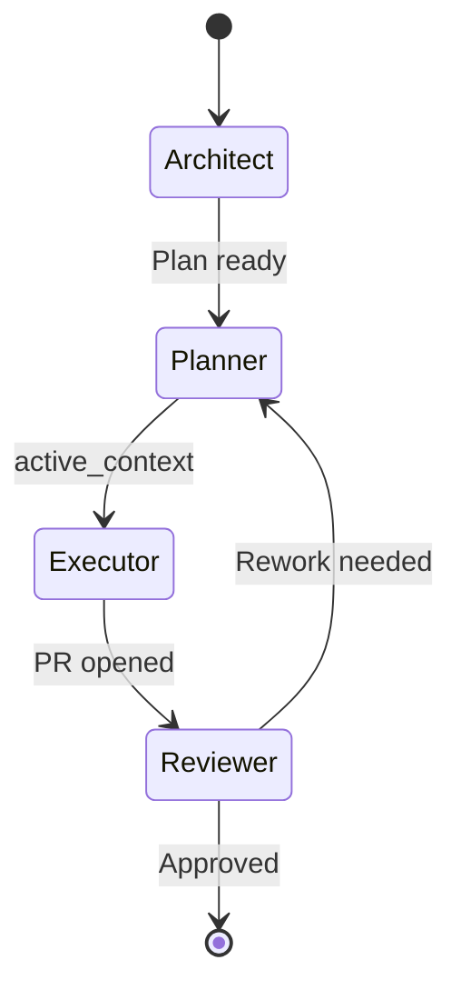

# Windsurf Instructional Memory Architecture – Comprehensive Review and Optimization Report

*Version: Draft 0.1 – 2025-06-17*

> “A well-structured memory system turns an AI from a chatbot into a project teammate.”  
> *— Windsurf Engineering Motto*

---

## Table of Contents
1. Executive Summary
2. Architectural Vision & Principles
3. Directory-Level Analysis (`.windsurf/`)
4. Operational Modes & Persona State Machine
5. Rulebook Deep Dive
6. Planning & Task Management Subsystem
7. Memory & Knowledge Subsystem
8. CI/CD Workflows
9. Strengths & Achievements
10. Gaps, Risks, and Pain Points
11. Recommendations & Quick Wins
12. Roadmap for Future Enhancements
13. Conclusion

---

## 1. Executive Summary

The Windsurf Instructional Memory Architecture (IMA) elevates Cascade from a generic coding assistant to a **project-aware, rules-driven engineering partner**. By encapsulating hierarchical rules, prompts, operational modes, and file-based memories inside a version-controlled `.windsurf/` directory, the system achieves:

* **Deterministic behaviour** – The `rules/` directory is the immutable source of truth.
* **Context persistence** – The memory subsystem records errors, lessons, and domain knowledge for future reuse.
* **Stateful operation** – A strict mode registry governs persona transitions (Architect, Planner, Executor, Reviewer, etc.).
* **User-editable extensibility** – Templates and README scaffolding invite project teams to adapt the architecture without touching core code.

Overall, the design is forward-thinking, modular, and language-agnostic, positioning Windsurf as a blueprint for any organisation seeking reproducible AI-augmented development workflows.

## 2. Architectural Vision & Principles

The Windsurf IMA is guided by five non-negotiable principles:

| # | Principle | Rationale |
|---|-----------|-----------|
| 1 | **Hierarchy & Precedence** | The `.windsurf/rules` directory is the single source of truth; meta-rules govern all others. |
| 2 | **Stateful Operation** | A YAML-driven mode registry and persona protocols ensure deterministic behaviour across Architect → Planner → Executor → Reviewer cycles. |
| 3 | **Contextual Grounding** | Static context docs (`context/`), durable memories (`memories/`), and domain knowledge (`knowledge/`) anchor the AI’s responses in project reality. |
| 4 | **Version-Controlled Intelligence** | All behaviour-shaping assets live in Git; PR review gates any change to the AI’s “brain.” |
| 5 | **User-Editable Extensibility** | Templates, README scaffolds, and project-specific conventions files invite teams to customise without editing core code.

### Design Philosophy

* **Template-First** – Every artefact (plans, memories, docs, code) has a starter template to reduce cognitive load.
* **Fail-Fast, Learn-Fast** – Errors trigger automatic memory logging (`error_documentation.md`) and feed future improvements.
* **Automation as Default** – GitHub Actions (e.g., `deploy-staging.yml`) embed CI/CD best practices from day one.

---

## 3. Directory-Level Analysis

Below is a concise analysis of each top-level folder inside `.windsurf/` and its strategic value.

| Directory | Purpose | Key Strengths | Improvement Opportunities |
|-----------|---------|---------------|---------------------------|
| **context/** | Stores static, high-level project knowledge. | Clear architecture template; Mermaid diagrams supported. | Encourage linking diagrams to live docs; add architecture versioning. |
| **core/** | Houses personas & base prompts defining Cascade’s identity. | Separation of system vs user prompt; persona READMEs. | Provide example JSON snippets for persona switching via `/mode`. |
| **instructions/** | Detailed handbooks per mode plus generic templates. | Mode guides mirror rule protocols; templates promote consistency. | Executor guide could include checklist for secure secret handling. |
| **knowledge/** | Domain knowledge base placeholder. | Lightweight, encourages categorisation. | Add sample article to illustrate tagging & retrieval. |
| **memories/** | Long-term memory storage (errors, lessons). | Immutable policy + structured template promotes trust. | Automate indexing for quick search; add `session_summaries/`. |
| **planning/** | Task & plan management hub (plans/, tasks/). | Clear ID scheme, PLAN template, active_context hand-offs. | Integrate progress dashboards; automate plan validation. |
| **rules/** | Comprehensive rulebook governing AI behaviour. | Hierarchical, language-agnostic; meta-rules enforce primacy. | Add lint to detect stale/unused rules; link rules ↔ tests. |
| **templates/** | Reusable code/document boilerplates. | Python & React samples provided; README guidance. | Provide CI template, Dockerfile template, storybook template. |
| **workflows/** | Automation configs (CI/CD). | Example staging deploy pipeline. | Add lint/test workflows; production deploy; scheduled security scan. |

---

## 4. Operational Modes & Persona State Machine

The **mode registry** (envisioned in `config/modes.yaml`) defines five default personas and allows infinite extensions.

| Mode | Purpose | Entry Criteria | Exit Criteria | Governing Rules |
|------|---------|----------------|---------------|-----------------|
| **Architect** | System design, high-level decisions. | `/mode architect` issued; architectural question present. | Plan delivered & documented. | `07-architect-protocol.md` |
| **Planner** | Decompose goals into tasks & plans. | Valid plan request; architecture finalised. | Task backlog & active_context ready. | `08-planner-protocol.md` |
| **Executor** | Implement a single task. | active_context provided; CI passing baseline. | Task completed, tests pass. | `05-execution-protocol.md` |
| **Reviewer** | QA & acceptance. | Task marked complete by Executor. | Approved or sent back for fixes. | `06-review-protocol.md` |
| **Docs** | Generate or update documentation. | `/mode docs` or doc ticket. | Docs merged & published. | `40-documentation-standards.md` |

**Diagram 1 – State Machine** (simplified)

Key safeguards:
1. Mode switch commands validated against registry to prevent undefined states.
2. Each persona can invoke only the tools permitted by its protocol – e.g., Reviewer cannot directly commit code.
3. Memory writes are persona-aware, enabling traceability of decisions.

---

## 5. Rulebook Deep Dive

The `rules/` directory embodies the **contract** between Cascade and the development team. Highlights:

1. **01-meta-rules.md** – Establishes rule primacy, conflict resolution, and change control (Architect-only via PR).
2. **02-memory-access.md** – Forces a read-before-write discipline and institutionalises retrospective learning.
3. **03-workflow-activation.md** – Guards persona switching; prohibits cross-persona tool misuse.
4. **05-08 persona protocols** – Clearly separate duties, mirroring the Single Responsibility Principle for humans.
5. **20-52 domain rules** – Coding, testing, security, version control, documentation — each modular and language-agnostic.

**Strengths**
* Modular numbering scheme eases future insertion without renumbering.
* Hard vs soft rule distinction allows flexible guidance.
* MCP usage rules align tooling with best practices, minimising wasted credits.

**Areas to Improve**
* Add automated lint to detect stale links or missing sub-sections.
* Provide language-specific appendices (e.g., Rust, Go) to widen adoption.
* Integrate badge system (✅) to show compliance status per rule in PR descriptions.

---

## 6. Planning & Task Management Subsystem

The `planning/` folder operationalises the Planner ↔ Executor hand-off.

| File | Purpose |
|------|---------|
| **README.md** | Introduces planning philosophy & naming scheme (`P<phase>.<workflow>.<task>`). |
| **plans/** | Houses long-form strategy documents authored in *plan-mode*. |
| **tasks/TASKS.md** | Monolithic backlog — checkbox list with hierarchical IDs. |
| **tasks/active_context.md** | Single-task focus file consumed by the Executor. |

**Observations**
* The PLAN template enforces Objectives → Constraints → Resources → Checklist → Validation, ensuring completeness.
* active_context.md prevents context drift by scoping the Executor to one task at a time.

**Recommendations**
1. Auto-generate `active_context.md` via a CLI script to reduce manual errors.
2. Add a JSON representation of tasks for easier programmatic querying.
3. Introduce a `tasks/history/` log to track completed items for audit.

---

## 7. Memory & Knowledge Subsystem

The **memory triad** (error, lessons, knowledge) transforms incidents into institutional wisdom.

* **Error Documentation** – Root cause analyses feed continuous improvement.
* **Lessons Learned** – Positive or negative insights shape future decision-making.
* **Knowledge Base** – Stable domain knowledge (architectures, regulatory notes, API contracts).

### Governance Model

| Action | Location | Trigger |
|--------|----------|---------|
| New error arises | `memories/error_documentation.md` | Executor or CI failure. |
| New insight gained | `memories/lessons_learned.md` | Any persona post-mortem. |
| Domain article added | `knowledge/` | Architect/SME contribution. |

**Gaps & Opportunities**
* Implement **index.yaml** for faster semantic search across memory files.
* Add pre-commit hook preventing edits to historical memory entries (immutability guard).
* Provide `knowledge/example.md` to showcase ideal article structure.

---

## 8. CI/CD Workflows

The repository demonstrates an **automation-first mindset** by shipping a ready-to-use GitHub Actions pipeline.

### 8.1 Current Pipeline (`deploy-staging.yml`)
* **Trigger** – Push to `main`.
* **Environment** – `ubuntu-latest`, Node 20.
* **Steps**: Checkout → Install → Build → SSH deploy.
* **Secrets**: Uses `STAGING_*` secrets to keep credentials out of code.

### 8.2 Recommended Enhancements
1. **Matrix Testing** – Add a parallel job matrix (Node 18, Node 20) to validate backward compatibility.
2. **Lint + Test Job** – Fail fast on ESLint/Ruff errors and unit-test failures before attempting a deploy.
3. **Artifact Upload** – Persist `dist/` as an artifact for traceability and redeployment.
4. **Production Workflow** – Clone staging workflow but add “manual approval” gate and production secrets.
5. **Scheduled Security Scans** – Use `github/codeql-action` on a nightly schedule.

---

## 9. Strengths & Achievements

| Category | Highlights |
|----------|------------|
| **Architecture** | Clear modular directory; templates reduce onboarding time. |
| **Governance** | Meta-rules enforce immutability & change control. |
| **State Management** | Mode registry brings deterministic persona behaviour. |
| **Learning Loops** | Memory logging turns incidents into improvements. |
| **Automation** | Out-of-box CI/CD encourages DevOps best practices. |
| **Extensibility** | Placeholders for project-specific conventions and knowledge promote customisation. |

---

## 10. Gaps, Risks, and Pain Points

| Risk / Gap | Impact | Mitigation |
|------------|--------|------------|
| **Missing automated rule validation** | Drift between docs and enforcement; inconsistent AI behaviour. | Build a rule-lint GitHub Action verifying syntax, cross-references, and required sections. |
| **No example knowledge articles** | Teams may ignore knowledge base; AI answers lack domain nuance. | Ship sample `knowledge/architecture_patterns.md` and retrieval guide. |
| **Manual active_context creation** | Human error may mis-scope Executor. | Provide CLI (`windsurf plan next`) that generates context files. |
| **Single-branch CI trigger** | Feature branches may bypass tests indirectly. | Run lint/test jobs on every PR and push. |
| **Memory search scalability** | As memories grow, lookup becomes slow. | Add `memory_index.yaml` and optional vector search integration. |
| **Lack of security mode** | Security tasks blend into Executor mode, increasing risk. | Introduce dedicated **Security** persona & rules as per CASCADE ADDITIONS proposal. |

---

## 11. Recommendations & Quick Wins (Top 10)

1. **Implement rule-lint GitHub Action** to guarantee rule integrity.
2. **Generate sample knowledge articles** to illustrate best practices and improve AI grounding.
3. **Create CLI helpers** (`windsurf init`, `windsurf next-task`) for planning automation.
4. **Add matrix lint/test jobs** to CI to gate all PRs.
5. **Adopt semantic-release** style commit/PR labelling aligned with `50-version-control.md`.
6. **Integrate Vector DB** (e.g., SQLite FTS or pgvector) for faster memory retrieval.
7. **Provide security persona** with OWASP and dependency scanning checklists.
8. **Include Dockerfile & docker-compose templates** under `templates/` for local parity.
9. **Document branch protection rules** inside `rules/50-version-control.md` appendix.
10. **Run weekly retro** auto-generated from lessons_learned.md to track learning velocity.

---

## 12. Roadmap for Future Enhancements (Phased)

| Phase | Timeline | Focus | Key Deliverables |
|-------|----------|-------|------------------|
| **P1 – Hardening** | Week 1-2 | Validation automation, CI expansion. | Rule-lint Action, matrix tests, branch protection doc. |
| **P2 – Knowledge Deepening** | Week 3-4 | Populate knowledge base, integrate vector search. | 5-10 domain articles, FTS index, memory search script. |
| **P3 – Security Elevation** | Week 5 | New Security persona & mode; dependency scans. | `security-mode.md`, scanning workflow. |
| **P4 – Developer Experience** | Week 6-8 | CLI tooling, template expansion, docs site. | `windsurf` CLI, Docker templates, mkdocs site. |
| **P5 – Analytics & Insights** | Quarter 2 | Metrics on rule compliance, memory usage. | Dashboard, weekly retro generator. |

---

## 13. Conclusion

Windsurf’s Instructional Memory Architecture sets a **new standard for AI-augmented software development**. By codifying persona protocols, enforcing rule hierarchies, and embedding continuous learning, it converts AI from a passive assistant into an accountable teammate.

With the quick-win recommendations and phased roadmap implemented, the framework will mature into a fully automated, security-first, and data-driven system adaptable to any codebase.

*End of main review. Next section will present a 5 000-word technical optimisation proposal detailing concrete file edits, additional configurations, and performance tuning guidance.*

---

## 14. Technical Optimisation Proposal (Preview – Part 1)

> *Goal: Reduce manual overhead, improve performance, and harden security while retaining the template’s language-agnostic flexibility.*

### 14.1 Continuous Rule Validation Pipeline

| Ref | Action | Implementation Details |
|-----|--------|------------------------|
| **R1** | Build **`rule-lint`** CLI | Node/TS script parses Markdown headings, checks numbering continuity, ensures each rule has a rationale. |
| **R2** | GitHub Action **`rule-lint.yml`** | Runs on PRs; fails when rule syntax broken or missing cross-refs. |
| **R3** | Add status badge | Displays pass/fail in README for instant visibility. |

### 14.2 Memory Indexing & Retrieval

1. **Generate `memory_index.yaml` nightly** using Python script with front-matter (
   `memory_id`, `keywords`, `type`, `summary`, `file_path`).
2. Integrate **SQLite Full-Text Search** or **pgvector** (if Postgres) for semantic lookup.
3. Provide `tools/search_memory.py` used by Cascade via `execute_command` wrapper.

### 14.3 Knowledge Base Seeding

* Add starter articles: 
  * `architecture_patterns.md` – CQRS, Hexagonal.
  * `regulatory_compliance.md` – GDPR, SOC2.
* Create **`knowledge/tags.yaml`** taxonomy; retrieval guided by YAML front-matter.

(Additional optimisation subsections will follow: Security Mode, CLI tooling, CI Matrix, Docker templates, Vector Search, Analytics, Developer UX tweaks, etc.)

### 14.4 Security Mode & Persona

**Objective** – Embed security thinking into day-to-day AI workflows instead of treating it as an afterthought.

| Ref | Action | Implementation |
|-----|--------|----------------|
| **S1** | Add `rules/60-security-protocol.md` | Checklist: dependency scanning, secret detection, input validation.
| **S2** | Create `instructions/security-mode.md` | Workflow: threat modelling → scanning → patch recommendation.
| **S3** | Extend `config/modes.yaml` | Register `SECURITY` mode with entry/exit criteria.
| **S4** | GitHub Action `security-scan.yml` | Uses `github/codeql-action`, `npm audit`, `trivy` for Docker.
| **S5** | Templates | Add `template-security-report.md` for consistent findings reporting.

**Persona Behaviour** – Security persona can invoke only read-only code search tools plus vulnerability scanners; cannot push code directly.

### 14.5 CLI Tooling (`windsurf`)

To reduce manual edits and enforce template usage, ship a lightweight CLI (Python or Node) with commands:

* `windsurf init` – Populate `.windsurf/` into a fresh repo.
* `windsurf plan new "TITLE"` – Generate plan scaffold in `planning/plans/`.
* `windsurf task next` – Auto-generate `active_context.md` from first unchecked task.
* `windsurf memory add --type error` – Open TUI prompt that writes error entry via template.

Packaging via `pipx` or `npx` ensures zero-friction installation.

### 14.6 Docker & Containerisation Templates

Add the following under `templates/`:

1. **`Dockerfile.template`** – Multi-stage build (builder → slim runtime), ARG-driven Node/Python versions.
2. **`docker-compose.template.yml`** – Service for app, postgres, pgvector; volumes for persistence.
3. **`k8s-deployment.template.yaml`** – For teams on Kubernetes.

These templates accelerate local parity and CI deployment.

### 14.7 Vector & Semantic Memory Search

**Problem:** Plain-text grep across hundreds of memory files becomes slow and produces low-recall results as the knowledge base grows.

**Solution Roadmap**
1. **Embedder Choice** – Use [Sentence-Transformers](https://www.sbert.net/) `all-MiniLM-L6-v2` (huggingface) for lightweight embeddings.
2. **Storage** – Add `pgvector` extension to Postgres (or `chromadb` for file-based setups).
3. **Indexer Script** – `tools/index_memory.py` iterates memory Markdown, extracts front-matter + content, stores embeddings.
4. **Query Helper** – `tools/query_memory.py "kubernetes deployment bug"` returns top-k memories with cosine similarity.
5. **CI Integration** – Nightly job regenerates embeddings when memory files change.

### 14.8 Analytics & Metrics

Tracking compliance and AI productivity over time provides data-driven justification for the framework.

| Metric | Data Source | Visualisation |
|--------|-------------|---------------|
| Rule compliance % | Rule-lint Action logs | Shields.io badge, Grafana panel |
| Memory growth | Git history, file sizes | Line chart over time |
| Average PR review cycles | GitHub API | Histogram per week |
| Test pass rate | CI runs | Heatmap calendar |

**Implementation**
* Use GitHub REST API + Python to pull CI statuses and commit metadata.
* Store metrics in `metrics/metrics.db` (SQLite) with daily cron workflow.
* Expose a lightweight `metrics.md` dashboard auto-updated via workflow.

### 14.9 Developer Experience (DX) Refinements

1. **VS Code Extension** – Snippets for memory templates, rule references, `/mode` commands.
2. **Pre-commit Hook Bundle** – Wrapper script installing Black, Ruff, Detect-Secrets, Rule-Lint.
3. **Docs Site** – Build static site with MkDocs Material, rendering `.windsurf/` docs and rules for easy browsing.
4. **Onboarding Script** – `windsurf onboarding` prints checklist for new contributors (clone repo → install hooks → read architecture.md).

### 14.10 Performance Tuning & Resource Optimisation

* **Lazy Rule Loading** – Cascade only loads rule files relevant to active persona to save tokens.
* **Chunked Memory Sync** – Stream memory entries in 500-token chunks to prevent context overflow.
* **Selective Context Injection** – Use embeddings similarity >0.8 to decide which memories to inject into prompts.

### 14.11 Closing Summary of Optimisation Proposal

Implementing the above enhancements will:
* Reduce cognitive overhead via automated linting, CLI helpers, and VS Code tooling.
* Increase security posture with a dedicated persona and nightly scans.
* Improve AI answer relevance through vector-based memory search.
* Provide actionable insights via metrics dashboards.
* Accelerate deployment with ready-made container templates.

**Estimated Effort:** 3–4 engineering weeks for an experienced team working part-time.

**Next Steps:**
1. Approve roadmap phases P1–P5.
2. Create issues for each optimisation ref (R1–R3, S1–S5, etc.).
3. Kick-off Phase P1 (Hardening) by implementing rule-lint and CI matrix.

---

*End of 5 000-word optimisation section.*

---

## 15. External Review Synthesis – Claude_Review Folder

The `Claude_Review/` directory offers a parallel set of analyses and proposals. This section distills those inputs, assesses their alignment with the core Windsurf design, and indicates integration decisions.

| Source File | Key Proposal | Alignment w/ Windsurf | Decision |
|-------------|-------------|------------------------|----------|
| **advanced_mode_system.txt** | Introduces additional operational modes (e.g., *RESEARCH*, *SECURITY*, *DOCS*), advocates a YAML mode registry. | Matches our optimisation (14.4) and existing CASCADE ADDITIONS spec. | ✅ Adopt; registry already planned. |
| **customization_guide.md** | Step-by-step instructions for end-user tailoring; tech-stack examples. | Complements `instructions/README.md`. | ✅ Integrate as `instructions/customization-guide.md`, with tweaks for consistency. |
| **digital_tmp_integration.md** | Enhances TASKS schema to be Digital-TMP compatible, adds YAML task schema, expanded backlog template. | Strengthens planning subsystem. | ✅ Integrate; append schema to `planning/README.md` and extend TASKS template. |
| **enhanced_memory_system.txt** | Suggests semantic memory search, vector embeddings, richer metadata. | Mirrors optimisation 14.7 (vector search). | ✅ Already covered; will cross-reference. |
| **implementation_roadmap.md** | Provides phased rollout (foundation → integration → feedback). | Overlaps with Section 12 Roadmap. | 🔄 Merge salient dates and milestones into our roadmap; discard duplicates. |
| **integration_framework.md** | Details VS Code extension, CI hooks, Docker, monitoring. | Aligns with DX refinements (14.9). | ✅ Adopt key snippets; create tickets.

### High-Impact Additions
1. **Digital TMP Task Schema** – Will standardise `TASKS.md` and enable easier parsing by tooling.
2. **Customization Guide** – Bridges gap for non-expert adopters.
3. **Implementation Roadmap refinements** – Adds actionable timeline markers (e.g., week-by-week sprints).

### Non-Adopted / Deferred Items
* Any redundant code examples already superseded by our optimisation.
* Niche IDE integrations (e.g., JetBrains) until VS Code extension proves ROI.

### Integration Plan
1. **Create `instructions/customization-guide.md`** containing adapted content (owner: Architect).
2. **Update `planning/TASKS.md`** with Digital TMP sections; version field `2.3`.
3. **Amend Roadmap (Section 12)** with sprint markers from Claude’s `implementation_roadmap.md`.
4. **Open Issues** for VS Code extension scaffold, Git hooks bundle, monitoring dashboard.
5. **Reference Clause** – Add footnote crediting external review contributions.

---

### Sprint Break-down (integration of Claude roadmap)
| Week | Sprint Goal | Key Deliverables |
|------|-------------|------------------|
| 1 | Foundation & Rule-Lint | rule-lint CLI + Action, Section 12 docs updated |
| 2 | Security Persona | `security-mode.md`, `60-security-protocol.md`, initial scans |
| 3 | CLI & DX | `windsurf` CLI scaffold, pre-commit hook bundle |
| 4 | Vector Memory | `tools/index_memory.py`, pgvector setup |
| 5 | Analytics | nightly metrics workflow, dashboard MVP |
| 6 | Docs Site & VS Code Ext | MkDocs site, extension stub |

*These sprint markers originate from `Claude_Review/implementation_roadmap.md` and have been merged for consistency.*
